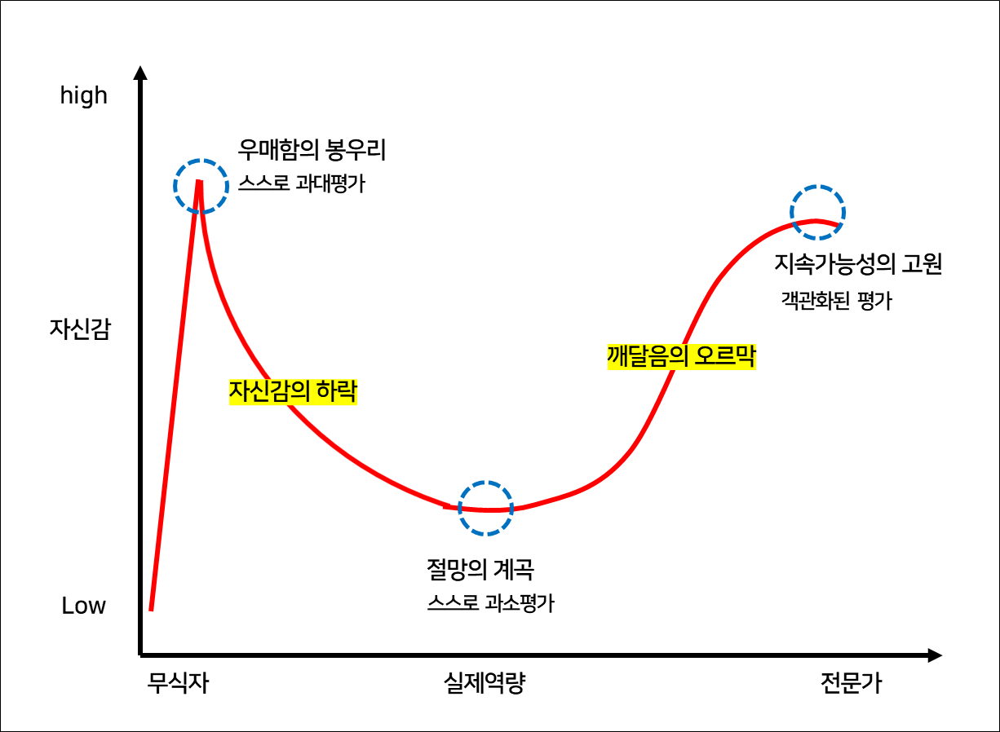

이번 글은 처음으로 나의 생각을 길게 담은 글이 될 예정이다.
글도 써본 사람이 잘 쓴다는데, 나는 사실 글 쓰는 것을 썩 좋아하는 편은 아닌지라 아쉽게도 필력이 좋진 않다.
그래서 소모임에 들어갔다. 그 첫 시작으로, 개발자를 희망하는 학생으로서 '어떤 개발자가 되고 싶은가'에 대해 고민하고 글을 써볼까 한다.

 

.
 
.
 
.
 
  
 
### #어쩌다보니 
나는 컴퓨터공학을 전공하는 학생이다. 그리고 현재는 웹 프론트엔드에 가장 관심을 가지고 공부하고 있으며, 당장의 목표 역시 웹 프론트엔드 개발자가 되는 것이다.
 
사실 처음부터 개발자가 되고 싶은 생각은 아니었다. 
나는 원래 어릴 때부터 손으로 무언가 만들고, 그리고, 꾸미는 것을 좋아했다. 그래서 초등학교 때까지는 비록 이것들과는 전혀 상관없는 꿈을 갖기도 하고, 수차례 바뀌기도 했음에도 솔직히 나는 커서 미대에 가지 않을까하는 생각이 컸다. 중학교 때는 막연히 디자이너가 되고 싶다고 생각했다. 그치만 어떤 디자인?이라고 묻는다면 떠오르는게 없었다. 정확히는 뭐라고 정의해야 할지 몰랐다. 그러다가 중학교 3학년 어느날, UX/UI 디자인이라는 것에 대해 접하게 되었고, 궁금증에 찾아보던 나는 순간 심장이 끓어오르는 것을 느꼈다.
 
'이거다.'
 
내가 원하던 거. 항상 생각해오던 무언가인데 그 무언가가 뭔지를 몰라서 막연했던 마음은 싹 사라지고 금세 호기심으로 가득찼다. 이 무렵 나는 친오빠의 영향을 받아 IT 이슈에 관심을 가지기 시작했고, 고등학교에 진학해서는 코딩 조기 교육을 받으며 IT 산업계 종사, UI/UX 디자이너라는 꿈을 굳혔다. 우리 학교는 과중점 자사고였기에 정규 수업, 방과후, 기타 비교과 활동을 통해 코딩 관련 스펙을 쌓을 수 있었고, 나름대로 성실히 학교 생활을 했던 나는 그것들을 적극적으로 참여했다. 근데 그렇다고 컴공과에 가고 싶다는 생각을 한 건 또 아니었다. 환경 자체가 미술쪽으로는 오히려 쌓을 수 있는 기회가 부족했고, 나는 대학에 가기 위해 내가 할 수 있는 걸 찾아 한거였다. 어찌됐든 결과적으로 코딩, IT 관련 경험을 많이 쌓게 되면서 나는 컴공생이 되었다. 정확히는 'IT공학' 전공인데, 들어와보니까 그냥 컴공이더라. 그러다보니 자연스럽게 '나는 그럼 이대로 개발자가 되는건가?'라는 생각이 들었다. 2학년 때 웹 프로그래밍 수업을 들으면서 처음으로 자신감이라는게 조금 생겼던 때를 제외하면 나는 계속 전공에 대한 의문과 회의감을 가졌었다. 그래서 그냥 컴공에 들어왔다는 이유로 개발자가 되긴 싫었다. 앞으로 최소 몇 십년 간은 코딩을 해야된다는 생각에 정신이 아득해지면서, 나는 그냥 안맞구나 싶었다.
그래도 어떻게 보면 그래도 나름 비슷하게 진로 잘 찾아서 온 편 아닌가? 싶기도 하다. 하지만 이런 상태에서 디자인에 대한 미련까지 여전히 크게 남아있던 나는 원래 나의 꿈을 떠올리며 시각영상디자인과를 복수 전공하려고도 했었다. 결과적으로는 포기하게 되었지만, 나름대로 수업도 들어보고 과제도 해보고, 교수님과 상담도 해보고 충분히 고민한 후에 결정한 것이기에 후회는 하지 않는다. 결국 지금의 내가 웹 프론트엔드에 뜻을 가지게 된 데에 영향을 주었기 때문이다.
 
  

### #프론트엔드를선택한이유 
이 부분은 사실 이미 앞에서 거의 다 얘기했다. 시영디 복전을 포기하고, 개발 공부를 시작하면서 내가 가장 흥미를 느끼고 잘 할 수 있는 분야라고 생각했다. 자랑을 하려는건 아니지만 어릴 때부터 관찰력이나 눈썰미가 좋은 편이었다. 남들이 보지 못하는걸 보고, 시각적으로 조금이라도 거슬리면 스트레스를 받을 정도였다. 또, 습관같은게 있었는데, 항상 어떤 서비스같은걸 쓰다보면 ‘이걸 왜 이렇게 만들었지, 이런 점이 너무 불편한데’, ‘이런식으로 바꾸면 좀 더 편하겠다’, ’이건 못생겼다‘와 같은 생각을 많이 했다. 물론 새로 무언가를 만들어내는 것과 누군가 만든걸 사용해보면서 불편함을 느끼고 개선점을 생각하는 것이 아주 많이 다르다는것을 지금은 안다. 아무튼 내가 느끼기에 나는 저런 면에선 꽤나 예민한 아이였다.
프론트엔드는 말 그대로 frontend, 보이는 쪽을 담당하며 보이지 않는 쪽을 다루는 백엔드와, 사용자 사이를 이어주는 역할을 한다. 그리고 작업 시에는 백엔드 개발자뿐만 아니라 디자이너와도 활발히 소통하기에 가장 의사소통이 잦은 직군이라고 할 수 있다. 이 점이 누군가를 귀찮다고 느끼려나? 잘 모르겠는데 일단 나는 재밌다. 개발 직군 중 UX와 UI, 디자인 모두에 가장 근접해있어 나에겐 가장 흥미로운 분야가 아닐 수 없다. 프론트엔드를 선택한 이유를 물으면 흔히들 '내가 작업한 결과물을 바로바로 눈으로 확인할 수 있다는 점이 흥미롭다'고 얘기한다. 이것도 맞지만, 나는 프론트엔드 개발자의 숙명과 같은 본질적인 면에서 흥미를 느끼는 것 같다. 
 
 

### #쓸모없는경험 
여기 흔해빠진 말이 있다.
'세상에 쓸모없는 경험은 없다.'
 
흔해빠졌지만 그 어떤 말보다 공감하는 말이다. 경험이란건 그 자체로 가치 있는 일이다. 설령 그것이 원하지 않던 경험일지라도, 얻는 것은 있기 때문이다.
 
내가 개발 공부를 해보기로 마음 먹은 건 정확히 시각영상디자인 복수전공을 포기하고 난 이후부터였다. 개발 공부라고 해봤자 거창한게 아니라 그냥 뭐라도 해볼까 하는 거였다. 그래도 웹 프로그래밍 수업 들을 때만큼은 재밌었어서, 프론트엔드 쪽으로 방향을 잡고 공부를 시작했다. 독학도 찔끔 해보고, 개발 동아리도 들어가보고, 대회도 나가보고, 외부 교육도 신청해보고, 그랬다. 개발이라는게 진입 장벽이 낮은 분야가 아니기에 당연히 무슨 맛인지 몰랐다. 그나마 남들과 비교했을 때 느껴지는 자괴감에 나도 잘해지고 싶다는 생각을 조금 했던 것 같다. 처음 해커톤에 나가봤을 땐, git도 다룰 줄 몰랐다. commit은 뭐고 push는 뭐고... 기본적인 개념조차 이해하지 못했다. 사실상 민폐 확정이었다. 그럼에도 나가기로 마음 먹었던 건, '할 줄 아는게 없어서 미루면 나중에는 과연 나아질까?'하는 생각 때문이었다. 나도 경험해봐서 알지만 기본도 한참 부족한 팀원을 데리고 해커톤을 치룬다는 것은 오히려 짐을 하나 더 주는 셈이다. 그래도 기회 삼아 배우려고 했고, 그때의 경험으로 '아직 부족하지만 뭐라도 해보자'는 마음가짐을 가지게 되었다.
처음에는 진전이 없는 것 같아도 하나 둘 경험하면서 조금씩 쌓이더라. 재능따위 없는 나 같은 사람도 조금은 성장하더라.
 
그래서 나의 추구미는 '도전'이다. 도전을 통해 어떤 경험을 했을 때, 성공을 하든 실패를 하든 얻어지는게 있을 것이고, 그게 다 나한테 쌓이는 것들인데, 안 할 이유가 있을까? 밑져야 본전이다. 실패를 해도 '아싸 이거 발판 삼아서 다음엔 성공할 수 있겠다ㅋㅋ'라고 생각하는 사람이 되자. 아직 젊으니까 이것도 되는거라고? 맞다ㅇㅇ 그러니까 뭐라도 해보자. 나 역시 그걸로 여기까지 왔다.
 
혹시 더닝 크루거 효과라고 아는 사람?
웹 프론트엔드 공부를 본격적으로 시작하고 리액트로 프로젝트를 두어번쯤 마쳤을 때, 그 때의 나는 딱 우매함의 봉우리에 서있었다. (사실 지금도 종종 착각하긴 함ㅋ..) 그러다가 한번 해커톤에 나간 이후로 내 자신감은 바닥을 찍다못해 거의 지하까지 파고 들어갈 지경까지 가기도 했다.

나에게 해커톤은 항상 절망의 계곡과 같았다. 뭔가 이루었다는 뿌듯함, 성장한 나를 발견하고 난 뒤의 성취감보다는 대체로 자괴감으로 가득했다. 하지만 돌이켜보면 그 과정이 있고 난 뒤에 오히려 더 성장한 것 같다. 나를 돌아보고, 문제를 찾고, 극복하려 노력했다. 그러면서 나도 제대로 하면 할 수 있다는 자신감이 생긴다. 동기가 생긴다. 또 성장한다. ... 이렇게 반복하다보면 점점 지속가능성의 고원에 가까워지지 않을까 생각한다. 깨달음의 오르막은 꽤 길고 가파르겠지만, 종종걸음이라도 꾸준히 걷다보면 도달하겠지.
 
  

### #친절한개발자 
1학년 때 프로그래밍 입문 수업을 들으면서 교수님이 자주 하셨던 말씀이 있다.
 
`모든 코드는 친절해야 한다.'
이 말이 뭔 뜻이냐 하면 코드의 목적이 분명하고, 사용자로 하여금 어떤 동작을 하는 코드인지 알게 하며, 확실한 예외처리로 모든 경우의 수에 대비하는 코드를 작성하라는 것이다.
 
친절한 개발자란 결국
사용자에게 보다 좋은 경험을 제공하는 개발자를 의미하는 것 같다. 사용자 경험? 그거 프론트엔드 한정 아니야?라고 누군가는 생각..하려나? 그렇지만 결국 우리가 개발을 하는 이유는 '사람'을 위해서이다. 그렇기에 사람이 필요로 해야 하고, 사람이 느끼기에 편리해야 한다. 서버 개발자가 서버 성능을 최적화하는 것 또한 사용자의 편리성을 고려한 행위이다. 때문에 여기서 프론트냐 백이냐 나누는 것은 나는 크게 의미가 없는 것 같다. 
결론은
'친절한' = '좋은'
이다.
 
아무튼, 나는 좋은 프론트엔드 개발자가 되고 싶다. 그럴려면 좋은 프론드엔드 개발자란 어떤 개발자인지 알아야 한다. 그래서 최근 들어서는 이거에 대한 생각을 많이 한 것 같다. 이전에는 그저 화면을 짜기에 바빴다. 프론트엔드 개발자가 하는 일은 디자인된 화면을 퍼블리싱하는 것만이 아니다. 오히려 퍼블리싱 능력은 프론트엔드 개발자가 갖춰야 할 소양들 중 극히 일부라고 생각한다. 웹 퍼블리셔라는 직업이 괜히 따로 있는게 아니다. 전체적인 구조를 어떻게 짜면 효과적이고 반응형 작업 시에도 최대한 효율적으로 할 수 있을지, 서버와의 통신을 어떤 방식으로 할지, 데이터들의 상태 관리는 어떻게 할지, 재사용성을 높이면서도 클린한 코드를 작성하는 방법, 사용자 경험을 개선하려면 어떤 작은 부분부터 고려하면 좋을지 등등... 일일이 말할 수도 없이 고려해야 할 부분들이 너무도 많다. 아직은 나도 감자이기에, 뭐 사실 많이 깨달은 것마냥 아는 척 하지만 훨씬 더 많이 고민해보고 찾아보며 배워야 한다. 그래도 이전과 달리 나아가야 할 방향들이 생기고, 스스로 고민하는 시간이 좀씩 늘어나면서 조금은 성장하지 않았나 싶다.
 
마지막으로 친절한 개발자가 되고 싶은 내가 그걸 위해 작성한 어록(사실 쓰다보니 생각남.. 별거없음주의)을 소개하고자 한다.
 
[개발자의 마음가짐](https://pingzeming.tistory.com/56)

개발 공부를 하면서, 할수록 점점 느끼게 된 것들이면서
지금도 나 스스로에게 하는 말들이다. 잊지 말자 !~
 
  
 
.
 
.
 
.

 
 
내 길은 어떻게 생겼을까
 
사실 아직도 잘 모른다. 하지만 내가 걸어가는 길이 곧 길이지 뭐ㅋ
조금 막막한 것 같이 느껴져도 별거 아니다. 그렇게 믿을 거다
 
그렇지만 고민은 계속 할거다
끊임없이 고민하는 사람이 성장하는 법이니깐.
사실 최근 들어서 이런 사람들이 유독 멋있게 느껴진다. 

멋진건 또 따라해줘야 인지상정
 
그리고 계속 길을 걸어갈 나를 응원할거다
ㅋㅋ다뒤졌당

 

ㅡ 
다 쓰고 나니 좀 많이 오글거리는데 이해좀 해주세요ㅜ