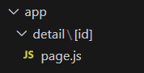
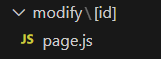
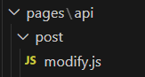

## 게시물 상세페이지 만들기

게시판 DB에 글 데이터를 몇 개 집어넣고 리스트를 조회하는거까지 해봤으니, 이제 특정 게시물을 눌렀을 때 해당 게시물의 상세페이지로 넘어가는 기능을 구현할 차례이다. <br />

### Dynamic Route
현재 게시물 리스트는 `/list`에서 조회하고 있고, 게시물을 선택하면 그 게시물의 id 값에 따라 `/detail/1`, `detail/2`, `detail/3` 이런식으로 url이 바뀌면서 그 내용을 보여주면 된다. <br />
<br />

1. 다음과 같이 `detail` 폴더를 만들고, 그 안에 `[id]`라는 폴더를 또 만든다. <br />
 <br />
`[폴더명]` -> 폴더 생성 시 이렇게 대괄호로 감싸게 되면, 이 부분에 어떤 내용이 와도 상관없다는 의미가 된다. 따라서 `/detail/123`, `/detail/ㅇ` 이렇게 입력해도 `/detail/[id]/page.js`가 보여지게 된다. <br />
<br />

2. 이제 보여줄 페이지를 만들어야하는데, 글의 제목과 내용을 보여주면 되므로 DB에서 꺼내오자. <br />
<br />

3. 근데 우리는 전체 게시물의 제목과 내용을 보여주는게 아니라 선택된 게시물의 것을 보여줘야 하기 때문에, 그 게시물에 관한 unique한 정보, 즉 id 값을 가지고 해당 게시물의 제목과 내용만 가져와서 보여줘야 한다. <br />

   - `findOne()` : document 전체 데이터가 아니라 하나만 가져온다.
   - `props` : url에 입력한 값(정확히는 `[id]` -> 이 부분)을 담고 있다. <br />

```javascript
export default async function Detail(props) {
  const db = (await connectDB).db("forum");
  let data = await db.collection("post").findOne({
    _id: new ObjectId(props.params.id),
  });

 return (
    <div>
      <h4>상세페이지</h4>
      <h4>{data.title}</h4>
      <p>{data.content}</p>
    </div>
  );
}
```
<br />

4. 여기까지 했으면 이제 리스트에서 글의 제목을 눌렀을 때 해당 글의 상세페이지로 연결시켜주면 끝이다. 3번에서 우리는 `props`를 사용해서 `detail/[id]`의 `[id]`에 어떤 값이 담겼는지 알아내어 어떤 게시물을 볼 것인지에 대한 정보를 얻어내도록 했다. 그러면 글 제목을 눌렀을 때 그 게시물의 id 값이 담긴 url로 이동을 시키는 방법까지 생각해볼 수 있다.
   - `<Link>`: 페이지를 이동시킬 때 사용 <br />
```javascript
<Link href={`/detail/${data._id}`} className="text-xl font-extrabold m-0">
  {data.title}
</Link>
```
<br />

> ✅ Link 태그 외 페이지 이동 방법
>
> - useRouter
>   - push, back, forward, refresh
>   - prefetch : 미리 로드 (`<Link>` 태그에도 내장되어 있으나, 모든 페이지를 미리 로드하는 것은 부담이 될 수 있기에 필요 없을 때에는 속성을 false 처리할 수 있다)
> - usePathname : 현재 url 출력
> - useSearchParams : search parameter(= 쿼리스트링) 출력
> - useParams : [dynamic route] 입력한 내용 출력

<br /><br />

## 게시물 작성하기

작성한 글을 바로 DB에 저장하는 것은 위험하기 때문에 서버에게 요청 후, 응답이 오면 DB에 저장하도록 할 것이다. = `3-tier architecture` <br />

### Next.js에서 서버 기능 개발하기
1. app 폴더 안에 api 폴더 만들어서 구현하는 방법
2. 루트경로에 pages 폴더 만들고 그 안에 api 폴더 만들어서 구현하는 방법
   <br /><br />

저는 두 가지 방법 중 2번 방법 사용함 <br /><br />

원래 서버 개발하면 보통 `/url GET 요청 시 이런 코드 실행해주세요~` 이거대로 짜는게 보통인데, Next.js에서는 자동 라우팅 기능이 있기 때문에 그냥 폴더 구조 잘 만들어놓고 그 구조에 맞는 url로 요청을 하면 해당 파일 안의 코드를 실행해준다. <br />
ex) `/pages/api/test.js` -> `/api/test`로 `GET` 요청하면 '요청 성공'이라는 응답을 반환

<br />

- 요청을 처리해주는 부분 (서버)

```javascript
// test.js
export default function handler(request, response) {
  return response.status(200).json("요청 성공");
}
```
<br />

- 서버에 요청을 보내는 부분
```javascript
export default function Write() {
  return (
    <div>
      <h4>글 작성</h4>
      <form action="/api/test" method="POST">
        <button type="submit">버튼</button>
      </form>
    </div>
  );
}
```
  - `<form>` 태그를 사용하면 POST, GET 요청을 쉽게 보낼 수 있다. (PUT, DELETE method는 사용 불가 ❗)<br />

<br /><br />

## 게시물 수정하기

1.  우선 각 게시물마다 수정하기 버튼을 만들고, 버튼을 누르면 해당 게시물의 수정페이지로 이동시킨다. <br />
     <br />
    이 때, 수정 페이지는 dynamic route를 사용하여 생성한다.

```javascript
  export default async function List() {
    const client = await connectDB;
    const db = client.db("forum");
    let data = await db.collection("post").find().toArray();
    console.log(data);

    return (
      // ...

      <Link href={`/modify/${data._id}`}>
        <button>✏</button>
      </Link>

      // ...
    );
  }
```
<br />

2.  어떤 게시물을 수정할 것인지에 대한 정보를 알기 위해, `props`를 사용하여 url에서 게시물의 id 값을 가져오고, 이 값으로 DB에서 `findOne()`을 사용하여 게시물의 제목과 내용, id를 가져온다. <br />
    가져온 기존 데이터는 `defaultValue` 속성을 사용해 화면에 보여주고, 내용을 변경한 뒤 수정 버튼을 누르면 `<form>` 태그 안의 값들이 `/api/post/modify`를 엔드포인트로 하는 서버에 요청이 간다. <br />
    이때 id 값은 왜 보내주냐면 그건 3번에서 알려줌

```javascript
  export default async function ModifyDetail(props) {
    const db = (await connectDB).db("forum");
    let data = await db.collection("post").findOne({
      _id: new ObjectId(props.params.id),
    });

    return (
      <div>
        <h4>수정페이지</h4>
        <form action="/api/post/modify" method="POST">
          <input type="text" name="title" defaultValue={data.title} />
          <input type="text" name="content" defaultValue={data.content} />
          <input name="_id" defaultValue={data._id.toString()} />
          <button type="submit">수정</button>
        </form>
      </div>
    );
  }
```
<br />

3.  글 수정하는 서버 기능 구현할건데, 요청 url에 맞게 디렉토리 및 파일 생성해주고, 변경된 내용을 DB에 갱신해주면 끝이다. <br />

### MongoDB에서 데이터 수정하기
```javascript
  await db
  .collection(컬렉션명)
  .updateOne({ 수정할게시물정보 }, { $set: { 수정할내용 } });
```

- `updateOne()` : documnet 수정 시 사용
  - `$set` : 덮어쓰기
  - `$inc` : 값 증가시키기
  - 더 있는데 필요할 때 그건 필요할 때 찾아서 해보자 ~.~

<br />

&emsp;&emsp;&nbsp; <br />

```javascript
// /pages/api/modify.js
export default async function handler(request, response) {
  if (request.method == "POST") {
    console.log(request.body);
    let newData = {
      title: request.body.title,
      content: request.body.content,
    };

    try {
      const db = (await connectDB).db("forum");
      let data = await db
        .collection("post")
        .updateOne({ _id: new ObjectId(request.body._id) }, { $set: newData });
      return response.status(302).redirect("/list");
    } catch (error) {
      return response.status(500).json("DB 갱신 실패");
    }
  }
}
```

newData라는 변수를 만들고, `updateOne()`을 사용하여 이 변경된 내용을 DB에 갱신시켜주도록 서버에서 처리하는 코드를 작성하였다. <br />

> ✅ 수정페이지에서 수정한 내용은 수정 버튼을 누르면 서버에 전달되는데, 이 데이터들은 `request.body` 안에 들어있다.
