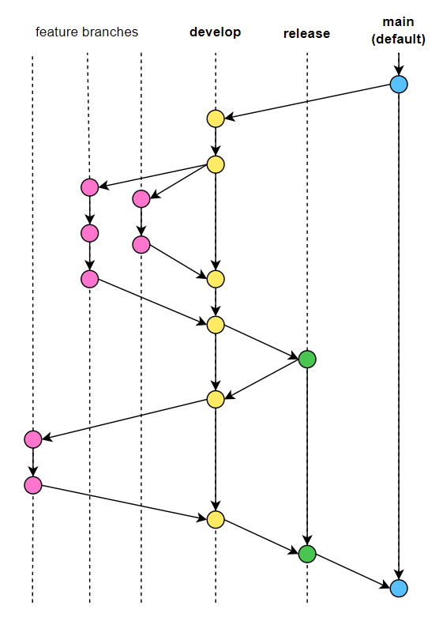

# Git Flow : 효율적인 버전 관리를 위한 브랜치 전략

현재 운영 중인 Cotato 프로젝트가 V2에 들어가면서  
기존에 겨우 구현만 해놓았던 부분들에 대해 리팩토링을 통한 성능 향상, 
체계적인 작업 관리, 
기존의 UX 및 UI 개선, 
새롭게 디자인된 페이지 적용 등등... 
 
팀원들 모두가 개발 전반에 있어서 부족했던 부분에 대해 고민하고, 좀 더 완전한 프로젝트로 거듭나기 위해 유지보수에 힘을 쓰고 있다. 
 
사실 우리 팀의 프론트팀도 개선할 점들이 넘쳐났는데, 특히 부족했던 프론트장(= 나..) 탓에 전체 회의를 제외하고는 우리끼리의 소통이 부족했던 것 같아서 우선적으로 정기 회의를 만들었다. V2에 접어든만큼 제대로 해보자는 의미에서 얻어가고 싶은 점들을 공유하고, 앞으로의 방향성에 대해 이야기를 나누었다. 
 
그 중 하나가 바로 Git Flow 적용에 대한 부분이었는데, 
V2에서는 우리 프로젝트의 최종 목적에 따라 기능과 페이지를 크게 확장할 예정에 있고, 특히나 프론트 입장에서는 전체적인 페이지 리디자인까지 이루어지기에, 효율적인 버전 관리를 위한 전략이 필요했다. 게다가 곧 CI/CD도 구축하는 것을 목표로 하고 있어, 이번 기회에 기존 레포지토리의 복제본을 만들고, 여기에 새로운 브랜치 전략을 적용하여 협업하기로 결정하였다. 
 
 

## 브랜치 전략 및 선정 이유
Git Flow는 우아한 형제들의 프론트팀에서 사용하는 전략을 참고하였다.  
크게 4가지의 브랜치가 사용되는데, 항상 유지되는 메인 브랜치(main, release, develop)와 일정 기간 유지되는 보조 브랜치(feature)로 나뉜다. 
각 브랜치의 역할은 정리하자면 다음과 같다.

> `feature` : 기능을 개발하는 브랜치 (hotfix 포함)  
> `develop` : 다음 출시 버전을 기다리는 브랜치 → 개발에 사용하는 브랜치 
> `release` : 이번 출시 버전을 준비하는 브랜치 (=QA 브랜치, test용) 
> `main` (default) : 실제 사용 서비스로 배포 및 출시되는 브랜치
 

우아한 flow와 달리 hotfix 브랜치는 따로 두지 않았으며, feature 브랜치와 동일하게 취급하여 사용 예정이다.

### release branch
현재 Cotato 프로젝트는 사이트를 운영 중에 있기 때문에 실제 프로덕트를 띄우는 서버와, 출시 직전 테스트를 위한 서버가 필요했다. 이전에는 테스트 서버를 두지 않았었는데 V2로 오면서 만들게 되었고, 이에 따라 프론트측에서도 프로덕트 브랜치(`main`)에서 뻗어나온 테스트용 QA 브랜치(`release`)를 생성하기로 하였다.  

### develop branch
개발이 이루어지는 브랜치로는 `develop` 브랜치를 두기로 하였고, 작업 이슈 하나하나에 대해서는 develop 브랜치로부터 feature 브랜치를 생성하여 사용하기로 하였다. 이 과정에서 고민이 있었는데, 세 명이서 협업을 하기 때문에 처음엔 다음 두 가지 방식을 떠올렸다. 
1. develop 브랜치와 그 자식 브랜치 3개를 두고, 각각에 작업한 내용을 올리는 방식 
2. dev1, dev2, dev3로 총 3개의 개발 브랜치를 두는 방식 

1번은 프로젝트 가장 초기 작업 시에 main 하나와 세 명의 이름으로 지은 브랜치 3개로 구성했던 것에서 따온 형식인데, 각 작업이슈까지 보조 브랜치로 뽑아서 사용하려면 꽤나 복잡해질 것 같아서 2번 방법을 같이 떠올렸다. 하지만 2번 방식은 세 개의 develop 브랜치에 대한 부모 브랜치가 없고, 바로 release에 병합되는 방식이기에 flow가 깔끔하지 않고, 용도에 따른 올바른 버전 관리가 힘들 것 같다는 생각을 하였다.  
따라서 develop 브랜치를 메인으로 딱 1개 두되, 각 이슈 작업 시마다 자식 브랜치로 feature 브랜치를 뽑아 사용하는 방식을 채택하게 되었다.
 

### feature branch
바로 위에서 설명한 것처럼 develop 브랜치에서 뻗어나온 브랜치로, 작업 보드에 올라와있는 task들에 대해 수행한 작업을 올리는 임시 브랜치이다. (merge 이후에는 즉시 삭제)   각 task의 issue명을 브랜치명으로 하여 작업 후, develop 브랜치로 PR을 올리면 된다.   -> ex. `feat/TC2_render_emoji_in_header`  
이때, 코드리뷰 문화를 살짝이나마 경험해보자는 의견을 수용하여 리뷰를 원하는 경우에 선택적으로 팀원들을 reviewer에 할당하기로 하였다. 급하게 합쳐야하는 부분이 아니라면 최소 한 명이 리뷰를 달 때까지 기다렸다가, 이후에 누구든 merge를 진행하면 된다.  

 

  
전체적인 흐름은 feature -> develop -> release -> main 방향으로 흘러가고, develop 브랜치에서 작업보드의 중분류에 해당하는 이슈 완료 시 release 브랜치로 올리고, 테스트 서버에서 검증 후 문제가 없다면 main 브랜치에 합쳐 출시하는 방식으로 이해하면 된다. 
 
 
 
여태까지는 협업 시 git을 기본으로 사용하기는 해도 어떤 식으로 관리해야 효율적일지에 대한 생각을 크게 해보지 않았었다. 하지만 Cotato 사이트를 직접 운영하며 사용자를 받고, 계속해서 디벨롭 해나가면서, 서비스를 유지하면서도 개선이 필요한 부분을 수정하고, 또 앞으로 더욱 확장해나갈 것을 고려하며 개발 외적으로도 신경 써야 할 부분들이 많다는 것을 느꼈다. 아니, 개발 외적인게 아니라 이런 모든 부분들이 개발에 포함된다는 것을 최근 들어서 배우게 된 것 같다. 실제로 개발자들은 새로운 기능을 구현하는 것보다 원래 있는 걸 유지보수 및 최적화시키는 일을 압도적으로 많이 한다는데, 확실히 V1에서 V2로 넘어가면서 결국엔 유지 및 보수를 위해 힘을 많이 쏟게 되는 것이 맞구나하는 생각이 들었다. 아직은 git에 대한 지식도 한참 부족하고, 전략대로 flow를 적용하여 작업하는 것이 익숙하지 않지만 이런 시도들이 결국 프로젝트를 진행하면 할수록 유의미하게 느껴지지 않을까 싶다. 반대로, 불편한 점들이 생기게 되면 나중에는 더 효율적인 방법을 찾아내는 데에 도움이 되지 않을까 기대가 된다!  
 

### +
V2 디자인이 메인 페이지부터 차차 완성됨에 따라 페이지 리디자인 작업을 시작했는데, 현재로썬 거의 가장 중요한 작업이기에 이에 대한 브랜치를 스프린트 브랜치로 따로 빼서 추가 생성하기로 하였다.  
리디자인 브랜치는 develop 브랜치로부터 생성하였으며, 자식으로 페이지별 브랜치를 두고, 그 안에서 이슈를 만들어서 작업한다.  
 
ex)
> 대분류 작업 - 페이지 리디자인  
> 중분류 작업 - 메인 페이지 리디자인  
> 소분류 작업 - 헤더, 섹션 1/2/3/, 푸터  

이와 같이 작업 목록이 있을 때, 소분류 -> 중분류 -> 대분류 흐름으로 feature 브랜치를 만들어 작업하여 합치는 방식이다.  
  
`feat/PCM-5_implement_section_1_view` -> `feat/PR-2_main_home_view` -> `sprint/PC-15_page_redesign` -> `develop`

 
 
 

---
참고 :  
https://techblog.woowahan.com/2553/  
https://hudi.blog/git-branch-strategy/