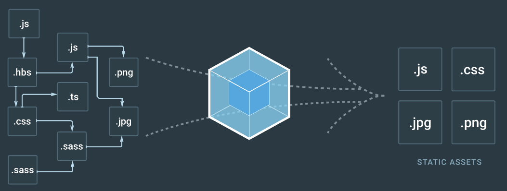
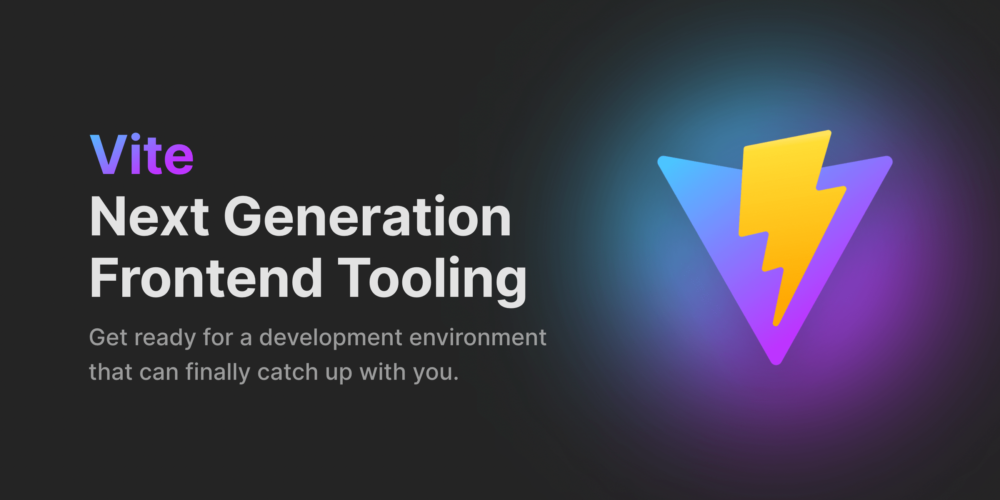
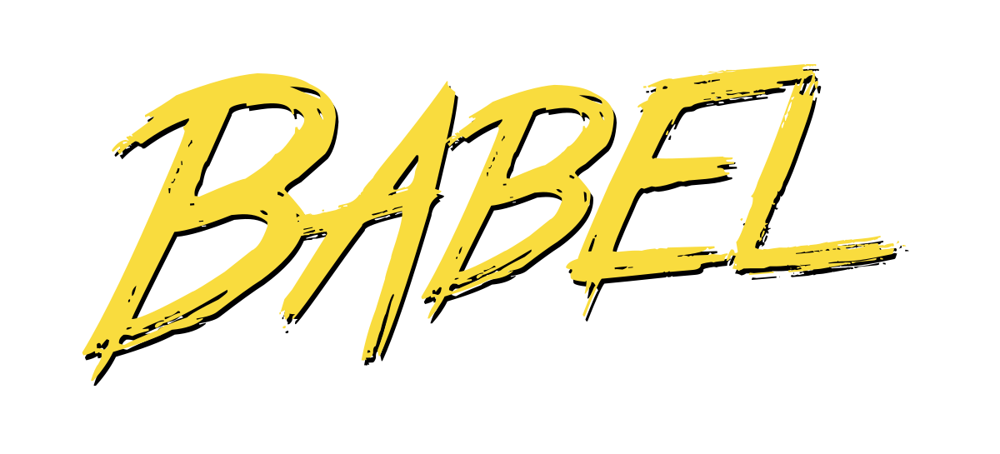

# Webpack과 Babel이란? (모듈 번들러, Webpack vs. Vite, Polyfill)

프론트엔드를 공부하다보면 한번쯤 웹팩, 번들, 바벨, 폴리필🤷‍♂️❓ 등등...과 같은 단어들을 들어본 적이 있을 것이다. 지금은 CRA를 사용해 초기 구축을 많이 하지만, 프로젝트를 완전히 커스터마이징해서 사용하기 위해서는 환경설정과 빌드세팅까지 직접 해야한다. 오늘은 그때 다루어야 할 개념들에 대해 포스팅을 쓰려고 한다. <br/> 궁금한 것도 많은데 알아야 할 것도 너무 많기 때문에 우선은 뭐가 뭔지 얕게만 정리해보면서 차차 알아가보자.

<br/><br/>

## 모듈 번들러(Module Bundler)

명칭 그대로 모듈 단위로 쪼개진 코드 조각들을 하나로 묶어주는 도구이다. <br/> JS, HTML, CSS, 이미지 파일 등을 포함한 모든 리소스를 최적화하여 하나의 파일로 만들어준다. 크롬과 같은 브라우저는 이 단일 파일을 로드함으로써 애플리케이션이 동작하게 된다.

### 왜 사용할까?

프론트엔드는 기본적으로 모듈 단위로 파일을 엮어서 개발하는 방식인데, 모듈은 서로 의존성을 띄기에 다음과 같은 문제들이 발생할 수 있다.

> - 수많은 모듈들에 대해 순서 처리 (의존성 문제)
> - 모듈의 양만큼 http 요청 또한 많아질텐데 이로 인한 오버헤드 처리
> - EX6+ 스펙의 코드 처리

javascript의 최신 문법에 해당하는 ES6부터 우리는 기존과 달리 import, export 구문을 통해 원하는 모듈만 쉽게 가져올 수 있게 되었고, HTML에서 모듈 형태의 자바스크립트를 불러올 수 있게 되었다. 따라서 index.js 하나의 모듈만 불러오면, index.js에서 import하고 있는 모든 모듈은 자동으로 따라 불러올 수 있게 되었는데, 아직까지 모든 브라우저가 이에 관해 지원하고 있지 않기 때문에 모든 파일들을 하나로 모아줄 필요가 있게 된 것이다. <br/> 아무튼 이런 문제들을 해결하기 위해 모듈 번들러가 탄생하게 되었다.

### 장점?

결론적으로, 우리는 bundler를 사용함으로서 파일의 크기가 줄어 한 번의 요청으로 파일을 받아올 수 있게 되었다. 이에 따라 네트워크 병목 현상이 해결, 로딩 속도가 향상되었고, JS 압축이나 CSS 전처리기 변환과 같은 작업을 자동화해주는 기능도 있어 추가 작업의 번거로움도 줄여준다.

<br/>

## 웹팩(Webpack)

웹팩(webpack)은 오픈소스 자바스크립트 모듈 번들러이다. <br/><br/>
(웹팩을 주제로 해놓고 앞에서 모듈 번들러에 대해 먼저 소개한 이유를 이제 알겠죠?) <br/> 모듈 번들러의 대표적인 종류로, Parcel, Rollup 같은 애들도 있는데 최신 프론트에서 가장 많이 사용되므로 우선은 webpack에 대해 먼저 알아보려 한다. <br/><br/>
 <br/>
Entry라고 하는 하나의 진입점으로부터 의존하고 있는 모듈 전부를 찾아내서 하나의 파일로 모아준다. <br/>

> - CommonJS, AMD,ES6 Module 포맷을 모두 지원
> - JS 외에도 복잡한 의존성들을 관리
> - Tree Shaking을 통한 성능 최적화
> - Code Splitting 기능

<br/>

### Webpack vs. Vite

다양한 번들러 중에서 한동안 미만잡 원탑이었던 Webpack을 제외하고, 빠른 속도를 자랑하는 Vite('비트'라고 읽는대요 전 여태 바이트인줄;)도 번들러로 제법 고려해볼만한 빌드 툴이다. <br/>

> - 애플리케이션의 모듈을 dependencies와 source code로 나누어 개발 서버의 시작 시간을 개선
> - 개발 시 ES Module을 넘어 HMR(Hot Module Replacement)와 같은 다양한 기능을 제공
> - 빌드 시 하나의 파일에 모든 종속 모듈을 전역 범위로 선언하여 결합
> - 번들링 시 Rollup 기반의 다양한 빌드 커멘드 사용 가능
> - Esbuild를 통한 사전 번들링으로 개발환경에서 매우 높은 속도 제공

<br/>
이러한 특징으로 인해 Webpack과 비교했을 때 개발 서버의 구동 속도가 빠르고, 소스 코드 갱신 또한 빠르다는 장점이 있다. <br/> 반면, 개발환경에서는 ESbuild를 사용하고, 프로덕션 환경에서는 Rollup으로 번들링을 수행하기 때문에, 개발 서버와 프로덕션 빌드 간에 최적의 출력과 동작 일관성을 보장하기가 쉽지 않다는 문제점이 존재하기도 한다. <br/><br/> 결론은 프로덕션 빌드 시 안정성이 떨어진다는 의견도 있지만 빠르고 간결한 개발경험을 맛보고 싶다면 Webpack 사용 이후에 Vite로의 마이그레이션도 도전해봐도 좋지 않을까 싶다.



<br/>

## 폴리필(Polyfill)

polyfill은 브라우저가 지원하지 않는 자바스크립트 코드를 지원 가능하도록 변환한 코드를 의미한다. <br/> 웹 환경이 정말 빠르게 변화하는 만큼 새로운 JS 문법이 나오고, 발전된 최신 기술과 도구들이 나오는데 브라우저에 내장된 엔진이 최신화된 자바스크립트 코드를 읽지 못하면 의미가 있을까? <br/> 따라서 하위 브라우저가 지원하는 자바스크립트 코드를 사용하여 자바스크립트의 최신 기능을 제공하는데, 이것을 가능하게 하는 것이 바로 폴리필의 개념이다.

<br/>

## 바벨(Babel)

 <br/>

```
The compiler for next generation JavaScript.
```

ㅡ [공식문서](https://babeljs.io/docs/)
<br/><br/>
바벨(babel)이란 최신 버전의 자바스크립트를 위한 컴파일러이다. <br/>
바벨은 polyfill을 위한 트랜스파일러로 사용되며, 브라우저가 지원하지 않는 최신 자바스크립트 코드를 이전 버전으로 번역해주는 역할을 한다. 덧붙이자면 ES6+ 문법을 사용하기 위해 바벨을 통해 구버전으로 변환해주는 것이다. 즉, 트랜스파일러로서의 역할과 동시에 폴리필을 지원하기에 바벨을 사용하는 것이다.

<br/><br/><br/>

<div align='center'>.&emsp;.&emsp;.</div>
<br/>
나중되면 CRA 대신 직접 환경 설정부터 빌드 설정까지 해볼텐데, 그때 가서 프로젝트에 가장 최적화된 세팅을 위해서 이것저것 공부도 하고 적용도 해봐야겠지만 적어도 기본적인 개념 일부는 미리 알아두는 것이 좋을 것 같았다. <br/> 그리고 사실 이 점을 제외해도 이제는 너무 많이 들어봤는데 그럼에도 뭔지 잘 몰라서 궁금했던게 제일 컸다. 겸사겸사 글을 쓰며 개념만 이해해보았는데, 다음에 CRA를 쓰지 않고 프로젝트 개발 환경을 구축할 기회가 생기게 되면 전반적인 구축 과정과 자세한 설정법, 어떤 도구 또는 기술을 선택하면 좋을지 고민한 과정들을 정리하여 담은 글도 한 번 작성해보고 싶다. 근데 이건 언제가 될지 모르겠다... 아직은 꽤나 나중이 될지도...ㅎ

<br/><br/><br/><br/>

---

참고 : <br/>
[[JavaScript] 번들러(Bundler)란?](https://blog.leehov.in/24) <br/>
[Webpack, Babel 설정 A to Z 정리(빌드 속도 개선, 폴리필 등)[Smody 프로젝트]](https://wonsss.github.io/webpack/webpack-all-in-one/) <br/>
[모듈 번들러란? - Webpack vs Vite 무엇을 써야 할까요?](https://enjoydev.life/blog/frontend/4-module-bundler#webpack-vs-vite) <br/>
[[개발지식] Webpack과 Babel은 왜 쓰이는 건지 알고 계신가요?](https://junghyeonsu.tistory.com/277) <br/>
[프론트엔드 개발 환경 체크리스트(2023)](https://blog.shiren.dev/2023-03-20/) <br/>
[Webpack → Vite: 번들러 마이그레이션 이야기](https://engineering.ab180.co/stories/webpack-to-vite) <br/>
[Vite 공식문서](https://ko.vitejs.dev/guide/)
[폴리필(polyfill)이란](https://db2dev.tistory.com/entry/%ED%8F%B4%EB%A6%AC%ED%95%84Polyfill%EC%9D%B4%EB%9E%80) <br/>
[WebPack과 Babel 그리고 Polyfill에 대해](https://velog.io/@hozzijeong/WebPack%EA%B3%BC-Babel-%EA%B7%B8%EB%A6%AC%EA%B3%A0-Polyfill%EC%97%90-%EB%8C%80%ED%95%B4#%ED%8F%B4%EB%A6%AC%ED%95%84) <br/>
