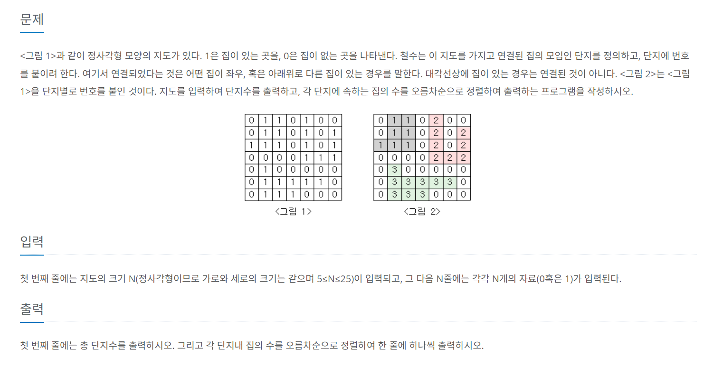

# [백준/Python] #2667 : 단지번호붙이기 - 그래프 알고리즘

https://www.acmicpc.net/problem/2667 <br/>
 <br/>

<br/>
딱 봤을 때 DFS 혹은 BFS로 풀면 되는 문제인 것을 알 수 있다. 나는 시작점에서 가까운 노드부터 차례대로 그래프의 모든 노드를 탐색하는 BFS를 이용해 풀이하였다. <br/>
<br/><br/>

### 💡 접근 핵심

1. 시작 지점에서부터 상하좌우를 살피며 집이 있으면 방문, 동시에 집의 개수를 센다. <br/>
2. 연결된 집을 모두 세면 하나의 단지 카운팅이 끝나게 되므로, 다음 집이 있는 위치를 다시 시작점으로 하여 단지 내 집의 수를 센다. <br/>
   - 이전에 방문한 단지의 집들은 모두 방문처리가 되어있으므로 그래프를 순회하며 다음 1이 오는 좌표부터 다시 너비우선탐색을 진행하면 된다. <br/>

<br/><br/>

그래프 알고리즘의 일반적인 유형에 가까운 만큼 bfs 함수를 작성하는 것은 크게 어렵지 않았으나, 고민이 되었던 부분은 집이 있는 위치에서 연결된 집들을 모두 찾고나면 bfs가 끝나게 되는 거라서 또 다른 단지에 어떻게 접근할지에 대한 부분이었다. <br/><br/>
그래프 전체(아파트 전체)를 봤을 때 처음 좌표부터 순회하며 1이 있는 좌표를 찾으면, <br/>

1. 그 지점을 시작으로 단지 하나를 카운팅하고, <br/>
2. 연결된 집들을 찾아 방문처리하면, <br/>

해당 단지 탐색을 마쳐도 이후에 접근하는 노드들 중 1을 발견할 시 위의 과정을 또 다시 반복하면 되는 일이다. <br/>
즉, 그래프를 순회하며 현재 위치가 1이라면, 그 집이 있는 단지의 총 집의 수를 반환하는 bfs 함수를 호출하면 된다. <br/>

<br/><br/>

### 풀이 과정에서 마주한 오류

```bash
TypeError: cannot unpack non-iterable int object
```

문제가 되었던 부분은 큐를 초기화하는 부분이었다. <br/>
처음에는 `deque((x, y))`와 같이 작성했었는데, 이렇게 하면 deque이 (x, y)를 정수로 받아들이게 된다. 따라서 `deque([(x, y)])`와 같이 수정하여 해결하였다. <br/>
> ✅ deque은 리스트나 튜플 등의 iterable한 객체를 받아야 한다.

<br/><br/>

### 정답 코드

```python
from collections import deque

n = int(input())
graph = [list(map(int, input())) for _ in range(n)]
result = []  # 결과를 저장할 리스트(각 단지의 집의 수)

# 상하좌우로 좌표를 이동하기 위한 리스트
dx = [-1, 1, 0, 0]
dy = [0, 0, -1, 1]

def bfs(graph, x, y):
    queue = deque([(x,y)])  # 큐 초기화(첫 번째 집의 좌표 추가)
    graph[x][y] = 0  # 첫 번째 집 방문처리
    count = 1  # 첫 번째 집을 방문한 것으로 시작했으므로 1로 초기화

    while queue:
        x, y = queue.popleft()  # 큐에서 하나의 집(x, y)을 꺼낸다
        for i in range(4):
            # 현재 위치에서 상하좌우로 이동
            nx = x + dx[i]
            ny = y + dy[i]

            # 이동한 좌표가 범위를 벗어나면 무시
            if nx < 0 or ny < 0 or nx >= n or ny >= n:
                continue

            if graph[nx][ny] == 1:  # 집이 있는 경우
                graph[nx][ny] = 0   # 해당 위치를 방문처리하고
                queue.append((nx, ny))  # 큐에 추가
                count += 1  # 방문한 집 카운트
    return count

# 그래프를 순회하다 집이 있는 경우, bfs를 수행하여 그 집이 있는 단지의 총 집의 수를 구한다
for i in range(n):
    for j in range(n):
        if graph[i][j] == 1:
            count = bfs(graph, i, j)
            result.append(count)
            count = 0

print(len(result))  # 단지의 수 출력
# 각 단지의 집의 수를 오름차순으로 정렬하여 모두 출력
for i in sorted(result):
    print(i)
```
