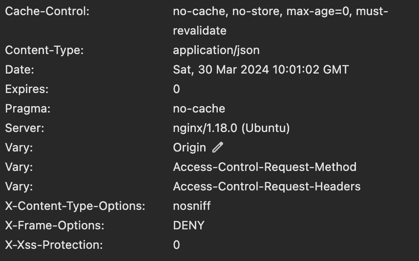
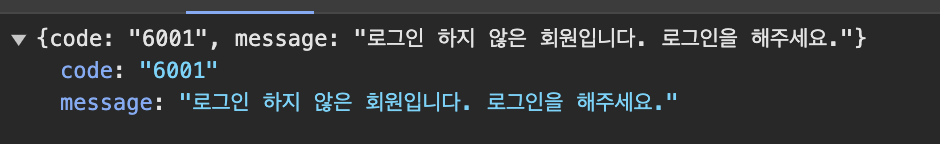

# ErrorResponse로 전달할 필드

프로젝트를 본격적으로 운영하며 예외처리에 대한 고민이 되기 시작한다. 

예외가 발생하면 ErrorResponse를 통해 클라이언트가 해당 요청에서 무엇이 잘못되었는지를 알려줘야하고 또한 서버에도 적절한 로그를 남겨 어떤 문제가 발생했는지를 기록해야한다.

즉, 예외가 발생했을때 적절한 **처리**를 통해 **2가지 목적**을 달성해야한다.

1. **클라이언트에 발생한 정보를 정확하게 전달해서 클라이언트가 적절한 예외처리**를 할 수 있게 하자.
2. **서버에 로그**를 남겨 어디서, 왜 에러가 발생했는지를 기록해야한다.

이 글에선 비즈니스 로직 내부에서 발생한 에러에 대한 ErrorResponse에 들어갈 필드가 어떤 역할을 해야하는지를 고민하고 글을 정리할 계획이다.

## 기존 반환 값

현재 전달하고 있는 ErrorResponse는 다음과 같다.

```java
public record ErrorResponse(
        @JsonFormat(
                shape = Shape.STRING,
                pattern = "yyyy-MM-dd HH:mm:ss",
                locale = "Asia/Seoul"
        )
        LocalDateTime time,
~~~~        HttpStatus status,
        ErrorCode errorCode,
        String message,
        String requestURI
) {

    public static ErrorResponse of(HttpStatus status, ErrorCode errorCode, String requestURI) {
        return new ErrorResponse(
                LocalDateTime.now(),
                status,
                errorCode,
                errorCode.getMessage(),
                requestURI
        );
    }
}

```

time: 에러가 발생한 시간,

status: 발생한 요청의 응답 HttpStatus

errorCode: 서버에서 정의한 ErrorCode (Enum)

message: 발생한 요청의 메시지

requestURI: 에러가 발생한 요청의 path

현재 사용하는 필드가 과연 적절하게 정보를 전달하고 있는지 다시 한 번 생각해봐야한다.

### 1. 시간

`LocalDateTime.now()` 를 생성자에 적어 에러 발생 시간을 반환하는게 의미가 있을까?

우선, 에러가 발생한 시간 정보는 로그에 자동으로 남는다.

하지만 프로젝트를 진행하며 프론트엔드 개발자와 이런 이야기를 할때가 있다.

**프론트: 나 이 시간에 여기서 에러 발생했는데 로그 확인해줄 수 있어?**

이럴 때 시간에 대한 정보가 사용되긴한다. 

하지만, `ErrorReponse.time` 값을 활용해 로그에 전달하지 않는다. 자동으로 로그에 시간이 남기 때문이다. 

또한 해당 시간은 Response로 전달하지 않더라도, 시간이 따로 브라우저에 기록되긴 한다. (GMT시간으로..) 



따라서, 시간 필드는 클라이언트에 전달할 필요도, 서버에 기록하는 용으로도 사용되지 않는 필드이다. 

### 2. Status

Controller 이후의 발생하는 예외를 다음과 같이 `GlobalExceptionHandler`에서 처리하고 있다.

```java
    @ExceptionHandler(AppException.class)
    public ResponseEntity<ErrorResponse> handleAppCustomException(AppException e, HttpServletRequest request) {
        log.error("AppException 발생: {}", e.getErrorCode().getMessage());
        log.error("요청 uri: {}", request.getRequestURI());
        ErrorResponse errorResponse = new ErrorResponse(
                LocalDateTime.now(),
                e.getErrorCode().getHttpStatus(),
                e.getErrorCode(),
                e.getErrorCode().getMessage(),
                request.getRequestURI()
        );
        return ResponseEntity.status(e.getErrorCode().getHttpStatus())
                .body(errorResponse);
    }
```

봐야할 포인트는 `ResponseEntity.status(e.status()).body(errorResonse);`  이다. 결국 응답 코드로 status를 전달한다. 따라서 ErrorResponse에 status 필드는 필요하지 않을 것 같다.

### 3. ErrorCode

HttpStatus외에도 추가적인 정보 전달이 필요하다. 

가령 404 Not Found로 에러를 띄웠다하더라도 Entity를 찾을 수 없는 것인지, 특정 필드를 찾을 수 없는 것인지 전달할 필요가 있다거나 또는 400 BAD_REQUEST로 사용자의 input이 잘못되었다면 어떤 input이 문제인지 알려줘야한다. 

현재는 **ENUM**의 이름 사용해 해당 에러를 알려주고 있다.

(CONFLICT와 관련된 에러 예시)

```java
    EMAIL_DUPLICATED(HttpStatus.CONFLICT, "존재하는 이메일 입니다."),
    SAME_PASSWORD(HttpStatus.CONFLICT, "이전과 같은 비밀번호로 변경할 수 없습니다."),
    GENERATION_NUMBER_DUPLICATED(HttpStatus.CONFLICT, "같은 숫자의 기수가 있습니다"),
    EDUCATION_DUPLICATED(HttpStatus.CONFLICT, "이미 교육이 존재합니다"),
    QUIZ_NUMBER_DUPLICATED(HttpStatus.CONFLICT, "퀴즈 번호는 중복될 수 없습니다."),
    PHONE_NUMBER_DUPLICATED(HttpStatus.CONFLICT, "존재하는 전화번호입니다."),
```

하지만, Enum명을 그대로 반환하게 된다면, 시스템의 약점을 파악하는데에 유리해 보안상의 리스크가 존재한다. 따라서, 예외처리 ENUM을 그대로 전달하는 것보단 별도의 클라이언트 개발자와 소통할 수 있는 코드를 만들어야한다.



### 4. 메시지

클라이언트 개발자는 예외처리를 3에서 언급했던 별도의 코드로 할 예정이다. 

그렇다면 이 메시지 필드는 왜 필요할까?

1. 클라이언트 개발자를 위한 에러 코드에 대한 간단한 부연 설명
2. 유저에게 띄워줄 alert창
3. 서버에 로그를 남기는 용도?

여기서 2가지 목적이 충돌하는 부분이 발생한다.

클라이언트에게 에러에 대한 명확한 정보를 전달하나 **‘서버만 알아야하는 중요한 정보’를 같이 전달하면 안된다.**

가령 다음과 같은 예외 메시지를 작성했을 때, 로그를 남기고 클라이언트에 `e.getMessage()`로 메시지를 같이 던지면 클라이언트에 불필요한 서버 정보 (email까지) 전달하게 되는 꼴이다.

```java
...
		() -> new EntityNotFoundException("회원 email이 {개인 이메일}인 회원을 찾을 수 없습니다.");
	
```

따라서, 발생한 에러코드의 메시지엔 서버 데이터와 관련된 값을 적지 말자. 

현재 App Exception이 발생했을때 아래와 같이 Handler 내부에서 `log.error` 로 에러 **메시지**를 남긴다.

클라이언트에 전달할 메시지 외에 구체적인 로깅이 필요하다면 에러가 발생한 위치에 하나의 log.error로 구체적인 에러를 남기는 걸로 정보를 얻어야겠다.

예시

```java
private void validateAlreadyCorrect(Quiz findQuiz, Member findMember) {
    if (recordRepository.findByQuizAndMemberAndIsCorrect(findQuiz, findMember, true).isPresent()) {
        log.warn("문제 번호: {}, 제출한 멤버: {}", findQuiz.getNumber(), findMember.getName());
	      throw new AppException(ErrorCode.ALREADY_REPLY_CORRECT);
    }
}
```

### 5. 요청 경로 (Path)과 메서드

요청 경로 또한 클라이언트가 브라우저에서 네트워크 탭을 보면 어느 요청, 어떤 메서드에서 에러가 발생했는지 알 수 있다. 괜히 path를 응답으로 전송해 굳이 우리 api의 엔드포인트를 외부에 노출할 필요가 있을까하는 고민과 어차피 브라우저를 까보면 다 나온다는 고민..을 하다가 남기기로 결정했다.

클라이언트에서 한 페이지를 렌더링할 때 동시에 여러개의 요청을 보낼때가 있는데, 이때 발생한 에러중 ‘어떤 요청’인지를 알아야한다고 판단했기 때문이다.

추가로 요청한 HttpMethod까지 같이 반환하면 이 부분에서 도움이 될 것 같다.

## 리팩토링 결과

따라서, ErrorReponse에는 최종적으로 예외 코드, 메시지, HttpMethod, 요청 경로 4가지 정보를 포함시킨다.

### 정적 팩토리 메서드 패턴 사용

기존에 에러를 반환하기 위해선 직접 생성자를 활용해 `ErrorResponse`를 반환했다. 이 과정에서 시간필드를 삭제하니 ErrorResponse를 반환하는 모든 부분을 수정해줘야했다. 

```java
public static ErrorResponse of(ErrorCode errorCode, HttpServletRequest request) {
    return new ErrorResponse(
            errorCode,
            errorCode.getMessage(),
            request.getMethod(),
            request.getRequestURI()
    );
}
```

유지 보수를 위해 정적 팩토리 메서드 of를 사용했다.

최종적으론 이런 ErrorResponse로 리팩토링한 코드이다.

```java
public record ErrorResponse(
        ErrorCode errorCode,
        String message,
        String method,
        String requestURI
) {

    public static ErrorResponse of(ErrorCode errorCode, HttpServletRequest request) {
        return new ErrorResponse(
                errorCode,
                errorCode.getMessage(),
                request.getMethod(),
                request.getRequestURI()
        );
    }

		//MethodArgumentNotValidException에 사용되는 경우
    public static ErrorResponse of(HttpServletRequest request, final List<String> errorFields) {
        return new ErrorResponse(
                ErrorCode.INVALID_INPUT,
                errorFields.toString(),
                request.getMethod(),
                request.getRequestURI()
        );
    }
}

```

Status까지 제거한 브랜치는 다음과 같다.

[https://github.com/IT-Cotato/CS-Quiz-BE/tree/refactor/error-response-0328](https://github.com/IT-Cotato/CS-Quiz-BE/tree/refactor/error-response-0328)

에러코드를 별도로 정하는 과정은 따로 단계를 끊어 글을 정리할 계획이다.