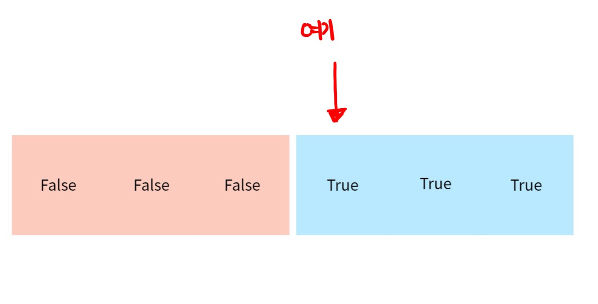
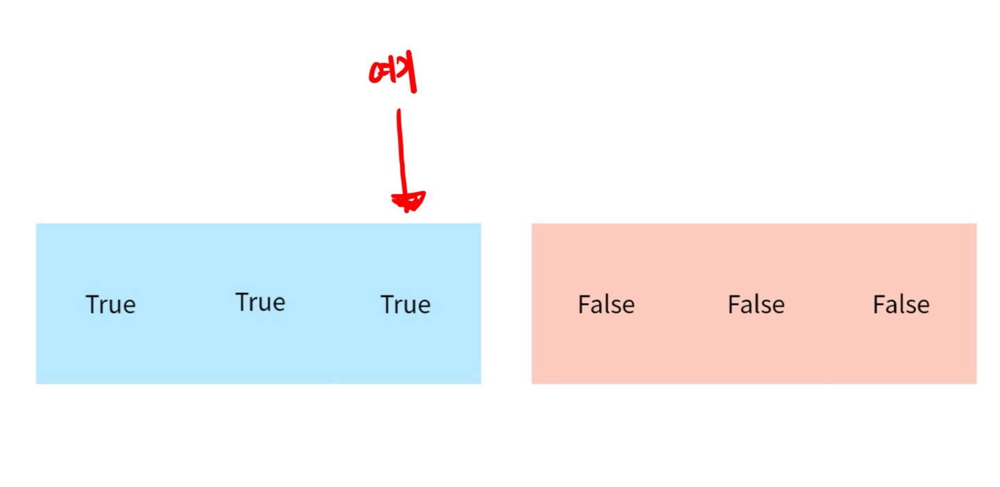

# [프로그래머스: 입국심사 Java] 매개 변수 탐색

다시 코테를 준비하는 요즘, 쉽다고 생각했던 이분탐색 문제가 조금 더 어려운 난이도로 등장해 애를 먹은적이 많다. 최근 치른 많은 코테에서 매개변수 탐색 문제를 쉽게 볼 수 있는데 관련해서 공부한 글을 정리해볼까 한다.

사실 어느정도 안다고 자신했는데, 우테캠 코테에서 최적화를 실패해 ,, 결국 탈락했으니 소 잃고 외양간 고쳐보자.

이 글은 ‘프로그래머스 알고리즘 고득점 킷 - 이분 탐색 - 입국 심사’ 문제를 기준으로 작성하겠다. 글을 읽기전에 알고리즘을 어느정도 공부했다면, 해당 문제를 풀이를 고민해보고 글을 읽으면 도움이 될 듯 하다.

https://school.programmers.co.kr/learn/courses/30/lessons/43238

### 문제 설명

n명의 사람이 입국심사를 받는다.  ( 1 ≤ n ≤ 1,000,000,000 )

여러명의 입국 심사관은 각각 1명을 통과시키는데 처리하는 시간이 다른데 이 값이 배열로 주어진다.

ex) [ 7, 10 ] : 심사관 1은 1명을 입국 심사를 하는데 7분의 시간이, 2는 10분의 시간이 걸린다.

이때, n명이 **입국심사를 통과하는 최소 시간**을 구하라.

## 이분 탐색이란?

정렬된 배열에서 특정 값의 존재 여부를 확인하기 위해 시작점(start), 끝점 (end) 사이의 중간 값 `(mid = (start + end) / 2)` 과 찾으려는 값을 비교한 후

1. 같으면 해당 값의 인덱스를 반환
2. 중간 값이 찾으려는 값보다 작으면 `start = mid + 1` 로 증가 시킨 후 다시 탐색
3. 중간 값이 찾으려는 값보다 크면 `end = mid - 1` 로 감소 시킨 후 다시 탐색한다.

찾으려는 범위를 절반으로 줄여가며 탐색하기 때문에 정렬하는 비용을 제외하면 $O(logN)$의 시간복잡도를 갖는다.

구현하는 방법은 2가지가 있는데 이 글에선 다루지 않겠다.

1. 재귀를 사용
2. 반복문을 사용

- lower_bound
    
    찾으려는 값보다 같거나 큰 값이 처음 나오는 위치
    
- upper_bound
    
    찾으려는 값보다 큰 값이 처음 나오는 위치
    

## 매개 변수 탐색

매개변수 탐색을 검색하면 ‘최적화 문제를 결정문제로 푸는 알고리즘’이라는 이야기가 많이 나온다.

최적화 문제란, 어떤 문제를 푸는 최적의 솔루션을 찾아내는 것이고

결정 문제란, 이미 결정되어 있는 답을 찾는 문제이다.

찾으려는 값을 매개변수로 생각하고 조건을 만족하는 **여러개의 값 중 최솟값 또는 최댓값**을 찾는 문제라면 매개변수 탐색을 고려해볼만하다.

반복문으로 구현하는 매개 변수 탐색의 코드는 보통 아래와 같은데

```java
/// ... 생략

long start = 1; 
long end = 어떤 가능한 최댓값

while(start <= left) {
		long mid = (start + end) / 2;
		
		long value = ?? // mid를 기준으로 찾으려는 값을 계산
		
		if(value <= target) { // 기존 이분 탐색과 다른점 (target은 목표하는 값)
				start = mid + 1;
		} else end = mid - 1;
}
```

여기서 주목할 점은 이분탐색은 찾으려는 값이 존재하는지, 또는 존재하는 위치를 찾는데 집중되어 mid를 기준으로 값이 같으면 바로 return을 한다.

하지만, 매개변수 탐색은 가능한 여러가지 값 중에 ‘최적의 값’을 찾아야하기 때문에 조건을 만족 했다고 해서 `(value == target)` 바로 값을 return 하지 않고 범위를 조정하며 더 나은 값을 찾는다. 

그렇다면 어떤 값을 return 해야 최적의 값을 찾을 수 있을까? 하는 고민이 생긴다.

이분 탐색에서 `while(start ≤ end)` 의 반복문을 보자.

반복문 내부에서 범위 조정은 `start = mid - 1;` 또는 `end = mid + 1;` 과 같은 방법으로 범위를 조정한다.

즉, ****조건을 만족하지 못했을 때, 반복문을 빠져나가는 경우는 아래 2가지이다.

1. end + 1 = start : end가 start 보다 작을때,
2. start - 1 = end : start가 end 보다 클 때,

특정 무언가를 만족하는 값은 여러개이지만, 그 중의 최소 지점을 찾는 경우라면,



end + 1 = start일때 반복문을 종료한다.

즉 end: F, start = T인 최소 지점이 되어 start를 반환하면 된다.

반대로, 무언가를 만족하는 값이 여러개인데 그 중 최대의 지점을 찾는 경우라면



start - 1 = end일때 반복문을 종료한다.

따라서, start : False, end : True인 최대 지점이 되어 end를 반환하면 최적의 값을 찾을 수 있다.

## 문제풀이: 입국 심사

이 내용을 바탕으로 입국심사 문제를 풀어보자.

우선, 매개변수를 잡는 것이 중요한데, 이 문제에서 찾아야하는 값은 N명이 입국심사를 통과하는 ‘최소 시간’이다.

매개변수는 N명이 입국 심사를 통과하는 ‘시간’으로 잡고 가능한 시간의 최댓값과 최솟값을 고민해 초기 범위를 정해야한다.

최솟값은 여려명의 입국 심사관이 1분만 심사를 할때이며

최댓값은 가장 시간이 오래 걸리는 심사관이 N명을 모두 심사할 때이다. 따라서, N * (가장 오래 걸리는 입국심사관의 시간) 으로 계산한다.

```java
Arrays.sort(times);
long start = 1;
long end = (long) n * times[times.length - 1]; // times가 int 타입이니 반드시 캐스팅해준다.
```

이후, 반복문을 통해 값을 탐색한다.

```java
while(start <= end) {
    long mid = (start + end) / 2;
    long peoples = countCanPassPeople(mid, times); // mid 시간동안 모든 심사관이 처리할 수 있는 최대 인원
    if(peoples >= n){ // 처리한 사람 수가 N보다 많아 -> 시간을 줄여야해
        end = mid - 1;
    } else start = mid + 1; // 적어? -> 시간을 더 줘야해
}
```

<br/>
<aside>
💡 참고: 이분 탐색을 할 때 mid = (start + end) / 2로 계산하는데, 이때 mid의 타입을 꼭 long으로 사용하는 가에 대해 고민해보자.
start, end가 int라도 위 연산은 두 값을 더한 후 2로 나누는 작업을 하기 때문에 `(start + end)` 과정에서 오버플로우가 발생할 수 있다.

</aside>

이때, mid 시간에 심사관들이 최대로 처리할 수 있는 사람을 계산하는 메서드를 `countCanPassPeople(long time, int[] times)` 로 구현해 사람 수를 구한 후

1. 처리할 수 있는 사람 ≥ 우리가 통과해야하는 사람 (등호 유의)
    
    mid 시간에 처리한 사람이 많으니 처리 시간을 줄여야한다. → end 범위를 줄인다.
    
    이때, mid가 찾을 수 있는 최소 시간이었다면, 반복문을 나가게 될 것이다.
    
    그렇다면 `end + 1 = start`가 될 것이다.
    
    따라서, end의 이전 값은 start와 동일했고, mid == start == end 였기에 start가 만족하는 최솟값이다.
    
2. 반대라면 시간을 더 줘야한다. → start를 늘린다.

따라서, 여러 범위에서 가능한 무언가를 찾는 최소, 최대 값을 찾는 문제를 보통 매개변수 탐색으로 풀 수 있다.

### 최종 코드

```java
import java.util.*;

class Solution {
    public long solution(int n, int[] times) {
        
        Arrays.sort(times);
        long start = 1;
        long end = (long) n * times[times.length - 1];
        
        while(start <= end) {
            long mid = (start + end) / 2;
            long peoples = countCanPassPeople(mid, times); // mid 시간동안 모든 심사관이 처리할 수 있는 최대 인원
            if(peoples >= n){ // 처리한 사람 수가 N보다 많아 -> 시간을 줄여야해
                end = mid - 1;
            } else start = mid + 1; // 적어? -> 시간을 더 줘야해
        }
        return start;
    }
    
    public long countCanPassPeople(long time, int[] times) {
        long answer = 0;
        for(int i = 0; i < times.length; i++){
            answer += (time / times[i]);
        }       
        return answer;
    }
}
```


### 여담

처음 이 문제를 봤을땐 이분 탐색 태그만 생각하고 특정 시간에 N명을 처리할 수 있으면 바로 값을 리턴했다. 즉, 최솟값을 찾을 수 없던 것이다.<br>
이분탐색이라도 최대, 최소에 관한 이야기가 나오면 어떤 변수를 매개변수로 잡을지를 고민하며 매개변수탐색을 떠올리면 좋겠다.