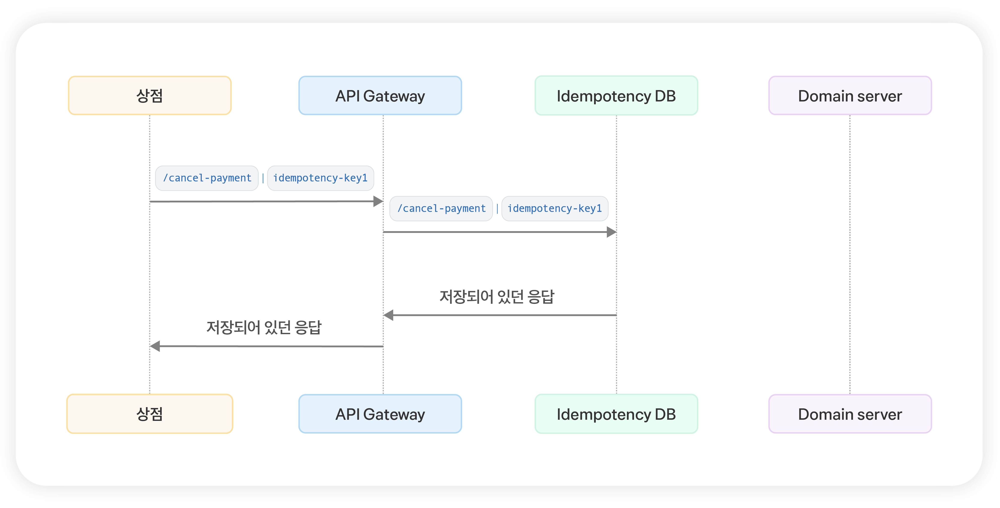

# 멱등성을 통한 정답 제출 API 중복 요청 방지 (이론)

지난 4월 27일 **토스 서버 개발자 챌린지**를 보며 결제 요청 타임아웃 처리에 관한 서술형 문제를 봤다.

<aside>
💡 결제 요청간에 타임 아웃이 발생했다. 해당 요청이 성공했는지 실패했는지 사용자는 알지 못하지만, 결제 요청이 2번되어서는, 안되어서는 안된다. 어떻게 이 문제를 해결할 수 있을까?

</aside>
  
나는 이 문제에 답을 하지 못했는데, 이후 오픈카톡방의 후기를 보니 ‘멱등성’을 통해 결제 요청 처리를 한다는 이야기가 나왔고 관련된 검색을 하던 중 토스의 멱등성에 관한 글을 읽게 되어 멱등성에 대해 공부하게 되었다.

읽고보니 비슷한 상황으로 인해 우리 코테이토 문제 풀이 요청 또한 결제 과정과 유사한 부분이 많다고 느껴졌고 멱등성 처리를 할 필요가 있다는 생각이 들었다.

따라서, 오늘은 멱등성에 관한 내용을 정리하고, 이를 서버에 직접 적용하는 과정을 정리해보겠다.

### 멱등성이란?

멱등성이란, 여러번의 같은 계산을 할 때 단 1회의 계산의 결과와 이후에 같은 계산을 여러번 한 결과가 동일한 성질을 의미한다.

수학에서 멱등성에 관한 예를 들면 절댓값 연산, 곱하기 1연산이 있는다.

- 어떤 숫자 A에 곱하기 1을 한 결과와 이후 계속 곱하기 1을 해도 결과는 똑같다.
- 어떤 숫자 B에 절댓값을 구한 결과와 이후 계속 절댓값 연산을 해도 결과는 똑같다.

### HTTP 메서드의 멱등성

HTTP 메서드에서도 멱등성을 적용할 수 있다. **사용자가 보낸 요청에 의한 리소스만**을 고려해 멱등성을 확인할 수 있다. 사용자의 같은 요청을 여러번 반복해도 서버의 리소스가 바뀌는지 여부에 따라 멱등성을 판단할 수 있다.

가령, GET 요청의 경우 같은 요청을 여러번 보내더라도 리소스의 변화없이 동일한 응답을 반환한다. PUT 요청 또한 멱등한 메서드인데 요청을 여러번 보내더라도 Payload에 있는 값이 그대로 **대체**되기에 멱등하다.

하지만, POST, PATCH 요청은 멱등하지 않다. 이런 멱등하지 않은 HTTP 메서드는 서버에서 별도의 처리를 통해 멱등한 값을 얻을 수 있다.

[관련 참고 자료](https://mangkyu.tistory.com/251)

- PATCH 요청이 멱등하지 않은 이유
    
    PATCH 요청은 `수정` 이란 의미의 1번처럼 사용되기도 하지만 범용적으로 사용된다. 가령 리소스에 값을 추가하는 상황에서도 사용된다.
    
    1. 특정 필드를 수정할 때
        
        `updateName(String name)` 이런 메서드가 실행된다면, 실행 결과는 동일함
        
        이런 경우는 멱등하다.
        
    2. 필드에 값을 추가하는 요청
        
        
- DELETE 요청이 멱등한 이유
    
    지우려는 리소스가 있는 상태에서 해당 리소스를 삭제하는 요청을 보냈다고 가정하자.
    
    1. 첫 삭제 요청이 성공 후 리소스가 지워진다. 200OK 응답
    2. 이후 삭제 요청은 지우려는 리소스를 찾을 수 없기에 404 NOT_FOUND를 응답한다.
    
    두 요청의 응답 값이 다른데 왜 delete메서드는 멱등할까?
    
    멱등성의 기준이 ‘상태 코드’가 아닌 서버의 리소스의 상태이기 때문이다. 
    
    N번을 호출해도 서버에는 리소스가 없는 상태가 유지되기 때문에 delete 메서드는 멱등하다
    

## API의 멱등성

HTTP 메서드를 통해 멱등성을 확보하지 못한다면, 서버에서 API 멱등성을 구현해야한다.

멱등한 API라면, 짧은 시간 2번 이상의 요청이 와도, 또 요청 후 결과가 끊겨도 2번 계산되지 않고 처음 요청과 동일한 결과가 반환되어야한다. 또한, DB의 상태 또한 동일해아한다.

가령, 흔히 생각하는 결제 요청 API에 대해 생각해보자.

1. 사용자가 광클을 통해 결제 요청을 2번 보낸 경우
    1. 결제가 2번 진행되면 안된다, 1번만 진행되어야한다. 따라서, 이 멱등해야하낟.
2. 사용자가 결제 요청을 보내는 과정에서 네트워크 타임아웃이 발생한 경우
    
    클라이언트는 이 경우 요청이 처리되었는지 아닌지 모른다. 따라서, 다시 진입해서 요청을 보내야한다.
    
    1. 요청이 처리되지 않은 경우라면 요청을 서버에서 받아서 처리하는 것이 정상이다.
    2. 서버에서 요청이 처리되었다면, 2번 결제 요청이 처리되는 문제가 생긴다.

이러한 부분을 해결하기 위해선 반드시 API의 멱등성을 처리가 필요하다.

### 일반적인 구현 방법

멱등성 처리를 구현하기 위해선 클라이언트에서 요청을 보낼 때마다 요청에 따른 ‘멱등성 키’를 Request Header에 넣어서 보낸다.

서버에서는 요청이 오면 우선 해당 요청의 헤더에서 멱등성 키를 찾고, 멱등성 DB에 해당 키에 대한 결과가 존재하는지를 확인한다.

1. 멱등성 키가 존재한다면 2가지 경우가 있다.
    1. 요청이 완료되어 DB에 완전히 저장된 경우 
        
        이 경우에는 도메인 로직으로 접근할 필요 없이 바로 저장된 값을 반환하면 된다. 
        
        미리 계산해둔 결과를 캐싱해둔 것이기에 멱등성 키를 사용하면 성능 개선에 도움이 된다고 한다.
        
    2. 요청이 들어오긴 했으나 아직 도메인에서 처리 중인 경우
        
        해당 경우는 굳이 다시 계산할 필요 없다.
        
        클라이언트에 아직 처리 중이라는 메시지를 보내면 된다.
        
        일반적으론 `409 CONFLICT` 계열의 에러 메시지를 보낸다고 한다.
        
2. 멱등성 키가 존재하지 않는 경우
    
    이 경우는 처음 들어온 요청이다. 따라서, 도메인 로직으로 넘어가서 값을 계산하고 반환하면 된다.
    
    단, 같은 요청이 이어서 들어올 수 있으므로 이때 멱등성 DB에 해당 키에 대한 요청이 ‘처리중’이라는 결과를 저장하고 도메인 로직에 들어가자.
    
    이후, 도메인 로직에서 응답을 반환하면 해당 응답을 멱등성 DB에 저장해 같은 요청이 왔을 때 결과를 보여주면 된다.
    

이거보다 완벽한 그림이 없는 듯해서 인용한다. (토스의 멱등성이 무엇인가요? 글에서 참고)

이어서 다음 글에서는 정답 제출 API의 멱등성 처리하는 과정을 글로 정리하도록 하겠다.

### 참고자료
[토스의 멱등성](https://docs.tosspayments.com/blog/what-is-idempotency)