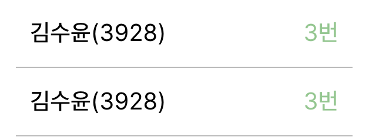
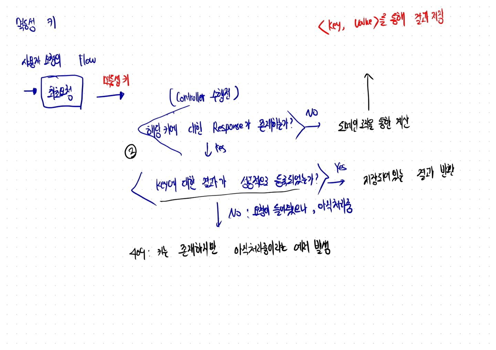
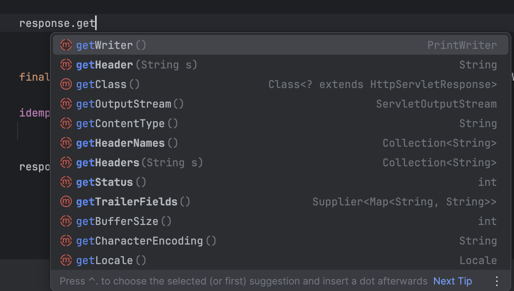
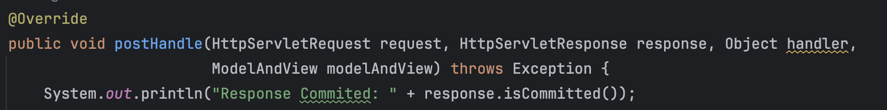
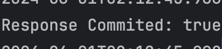
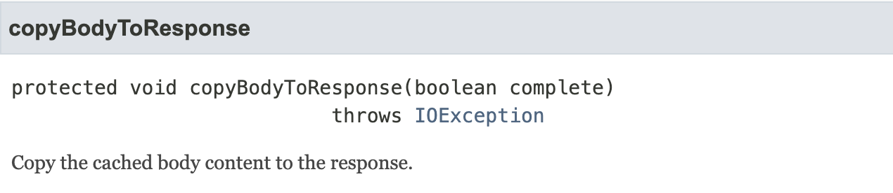
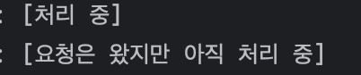
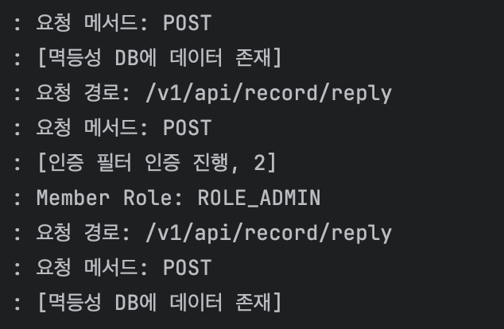
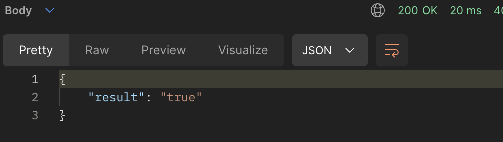

# 정답 제출 API 멱등성 처리하기

앞선 글에서 HTTP 멱등성과 API의 멱등성을 구현하는 과정에 대한 내용을 정리했다.

이번 글에서는 현재 Cotato 정규 세션 문제 풀이에서 사용하는 로직인 ‘정답 제출’ API에 멱등성 처리를 하는 과정을 글로 정리하겠다.

### 정답 제출 API의 멱등성 처리 필요성

정답 제출 API의 서비스 로직을 간단하게 정리하면 아래와 같다.

1. 정답이 아니면 제출 기록을 생성 후 저장한다.
2. 정답인 경우
    1. **이미 득점처리가 되었는지 확인한다.**
    2. 득점자보다 해당 제출 기록이 더 빠르면 득점자로 대체한다.
    3. 득점자보다 느리면 단순히 기록을 저장한다.

이때 핵심은 정답 처리가 된 요청은 하나만 생성되어야한다는 점이다.

하지만, 우리는 선착순으로 득점자를 정한다. 그렇기 때문에 사람들은 풀이가 허용되는 시점 이전에 무수한 요청을 보내는데 요청이 처리되는 사이에 새로운 요청이 들어오면 가령 아래와 같이 정답 요청이 2개가 생기는 경우가 있다.



정답임에도 2개의 데이터가 생겼다.

최초 요청외에도 중복으로 리소스가 생성되는 문제가 발생한 것이다.

득점자는 유일하지만, 정답 기록은 여러번 생기게 된 것인데, 우리는 API에 멱등성 처리를 할 필요가 있다고 느꼇다.

물론, 프론트엔드에서 광클 방지로 단시간에 같은 요청을 여러번 보내지 못하게 해 이러한 상황을 막을 수 있지만, 서버 개발자는 클라이언트가 어떤 행동을 하더라도 일관된 응답을 주는 것이 중요하다고 생각하기 때문에.

가령, 팝업이나 클라이언트의 광클 방지 처리가 실패하더라도 서버 개발자의 의도에 맞는 로직으로 흘러야한다.

또한, 지난 5월 1일 **‘타임아웃과 관련된 네트워트 테스트’**를 진행했는데, 타임아웃이 발생하더라도 동일한 처리를 할 수 있어야 하지 않을까? 하는 생각이 들었다.

또한, 중간에 타임아웃처럼 연결이 끊긴 사용자라도 다시 접속되었을때 풀이의 결과를 알려줘야할 필요가 있었다.

이 멱등성 처리는 필수다.

따라서, 이번 글에선 멱등성에 대한 간략한 설명과 이를 실제로 구현하는 과정을 정리해보려고 한다.

## 구현 아키텍처


토스의 멱등성 관련 글은 MSA 기반으로 API GateWay에서 요청을 한다.

하지만, 우리 서버는 단일 서버이다. 별도의 API Gateway가 존재하지 않는데, 멱등성 처리의 장점 중 하나가 ‘도메인 서버에서 로직을 여러번 처리하지 않아 성능에 이점이 있다.’라는 부분을 지키고자.

우리도 도메인 로직에 들어가기 전에 멱등성에 대한 설정을 한다면, 성능이 개선되지 않을까? 하는 생각이 들어 적어도 Controller단 이전에서 처리하고 싶었다.

<aside>
💡 HTTP → WAS → 필터 → 인터셉터 → 컨트롤러

</aside>

클라이언트가 요청을 하면 위와 같은 구조로 요청이 처리되는데 인터셉터와, 필터에서 멱등성 처리를 구현할 생각을 했다.

## Interceptor를 통한 구현

`HandlerInterceptor` 를 상속받아 구현하는 스프링 인터셉터에는 3가지 메서드가 존재한다

- preHandle: Controller(Handler)에 진입하기 전에 실행되는 메서드
- postHandle: Controller에서 예외가 발생하지 않으면 해당 메서드가 실행된다.
- afterCompletion: 예외 발생 여부에 상관없이 반드시 실행된다.

따라서, `preHandle` 메서드에서 다음 작업을 할 예정이다.

1. 멱등성 키에 대해 성공한 결과가 있으면 바로 반환한다.
2. 멱등성 키에 대해 데이터가 처리 중이면 409 에러를 발생한다.
3. 키가 존재하지 않으면, 처리 중인 값을 DB에 넣고 도메인 로직을 실행한다.

이후, `postHandle` 에서 3번에서 실행한 데이터에 대한 결과 즉, Response Body를 읽고 멱등성 DB에 저장한다.

위 과정이 잘 이해 안되면 아래 그림 참고 부탁 .. ㅎ 



여기서 멱등성 DB는 캐시의 성격을 띄고 있고 Key,Value로 관리되기에 Redis를 활용했다.

**preHandle메서드**

```java
@Override
public boolean preHandle(HttpServletRequest request, HttpServletResponse response, Object handler)
        throws Exception {
    String idempotencyKey = request.getHeader(IDEMPOTENCY_HEADER);
		// 헤더에 키가 없으면 바로 도메인 로직 진행
    if (idempotencyKey == null) {
        return true;
    }
    ObjectMapper objectMapper = new ObjectMapper();
		
		// 성공한 결과가 있으면, 존재하는 결과 반환
    if (idempotencyRedisRepository.hasSucceedResult(idempotencyKey)) {
        response.getWriter()
                .write(objectMapper.writeValueAsString(
                        idempotencyRedisRepository.getSucceedResponse(idempotencyKey)));
        return false;
    }
		
		// 해당 요청이 처리 중이면, 409 에러를 반환
    if (idempotencyRedisRepository.isProcessing(idempotencyKey)) {
        response.setStatus(HttpStatus.CONFLICT.value());
        response.getWriter()
                .write(objectMapper.writeValueAsString(ErrorResponse.of(ErrorCode.PROCESSING, request)));
        log.info("[요청은 왔지만 아직 처리 중]");
        return false;
    }

    // 캐시에 결과가 존재하지 않으면 -> 처리중이란 값을 넣고 도메인 로직을 실행함
    idempotencyRedisRepository.saveStatusProcessing(idempotencyKey);
    return true;
}
```

postHandler메서드

```java
@Override
public void postHandle(HttpServletRequest request, HttpServletResponse response, Object handler,
                       ModelAndView modelAndView) throws Exception {

    String idempotencyKey = request.getHeader(IDEMPOTENCY_HEADER);
    ObjectMapper objectMapper = new ObjectMapper();

		//Response Body에 있는 값을 읽고 저장
    idempotencyRedisRepository.saveSucceedResult(responseBody);

    responseWrapper.copyBodyToResponse();
}
```

### ResponseBody를 읽을 수 없음.

postHandle 메서드의 파라미터인 `HttpServletResponse` 를 통해 ResponseBody를 읽고자 했으나 어떤 데이터도 읽을 수 없었다.



Spring 에서 HTTP  요청이 오면 응답을 Servlet Reponse에 있는 값을 Stream을 통해서 전달한다.

이때, Stream은 한 번 읽고 사라지는 값이라, 1회성이다.

인터셉터에서 읽으면 클라이언트에게 값을 전달할 수 없으며 무엇보다 Controller에서 ResponseEntity가 생성되고 빌드될 때 이미 응답이 커밋된다.

따라서, postHandler메서드 첫줄에 다음과 같은 로그를 찍으면 이미 서블릿 response가 커밋되었다는 결과가 나온다.





## 서블릿 Response를 복사하자

한 번 읽고 사라지는게 문제이면 복사하면 되지 않을까? 하는 생각이 들었다.

스프링에서는 이 구현을 가능하게 해주는 **ContentCachingResponse** 가 있었는데 간단하게 설명하면 response를 메모리에 새로운 값을 캐싱해 Stream외에도 읽을 수 있게 한다.

이후 `copyBodyToResponse()` 를 호출해 캐싱된 response를 클라이언트에 전달한다.

따라서, `copyBodyToResponse()` 를 꼭 마지막에 실행해야한다.



자세한 내용은 이런 글을 읽어보도록 하자.

[참고자료](https://velog.io/@0_0_yoon/ContentCachingRequestWrapper-ContentCachingResponseWrapper-wxndicpk)

- 유의사항
    - 메모리에 응답을 캐싱하므로 메모리 사용량을 주의해야한다.

아무튼, Interceptor이전에 복사가 가능한 ContentCachingResponse를 서블릿 Response로 바꿔주는 필터를 등록하면 이후 인터셉터에서 Response를 읽을 수 있다.

```java
@Component
public class CustomServletWrappingFilter extends OncePerRequestFilter {
    @Override
    protected void doFilterInternal(HttpServletRequest request, HttpServletResponse response, FilterChain filterChain)
            throws ServletException, IOException {

        final ContentCachingResponseWrapper responseWrapper = new ContentCachingResponseWrapper(response);
        filterChain.doFilter(request, responseWrapper);

        responseWrapper.copyBodyToResponse();
    }
}
```

### Interceptor에선 Response를 바꾸는 것이 불가능했던 이유

Interceptor에서도 위와 같은 구현을 하는게 가능할까? 라는 생각을 했다.

DispatcherServlet 이 전달 받는 요청 객체를 ContentCachingRequestWrapper 로 바꿔치기해야 하는데 인터셉터에서는 할 수 없었다.

필터의 경우 `doFilter(request, response)` 메서드를 통해 서블릿 Request와 Response를 다음으로 넘겨준다. 하지만, 인터셉터는 이렇게 파라미터를 넘겨주지 않기 때문에 구현이 불가능헀다.

## 결과

따라서 Interceptor를 아래와 같이 구현할 수 있다.

```java

@Slf4j
@Component
@RequiredArgsConstructor
public class IdempotencyInterceptor implements HandlerInterceptor {

    private static final String IDEMPOTENCY_HEADER = "Idempotency-Key";
    private final IdempotencyRedisRepository idempotencyRedisRepository;

    @Override
    public boolean preHandle(HttpServletRequest request, HttpServletResponse response, Object handler)
            throws Exception {
        String idempotencyKey = request.getHeader(IDEMPOTENCY_HEADER);
        if (idempotencyKey == null) {
            return true;
        }
        ObjectMapper objectMapper = new ObjectMapper();

        if (idempotencyRedisRepository.hasSucceedResult(idempotencyKey)) {
            response.getWriter()
                    .write(objectMapper.writeValueAsString(
                            idempotencyRedisRepository.getSucceedResponse(idempotencyKey)));
            log.info("[멱등성 DB에 데이터 존재]");
            return false;
        }

        if (idempotencyRedisRepository.isProcessing(idempotencyKey)) {
            response.setStatus(HttpStatus.CONFLICT.value());
            response.getWriter()
                    .write(objectMapper.writeValueAsString(ErrorResponse.of(ErrorCode.PROCESSING, request)));
            log.info("[요청은 왔지만 아직 처리 중]");
            return false;
        }

        // 캐시에 결과가 존재하지 않으면 -> 처리중이란 값을 넣고 컨트롤러를 실행함
        idempotencyRedisRepository.saveStatusProcessing(idempotencyKey);
        return true;
    }

    // 컨트롤러 실행 후 -> 해당 키에 대한 결과를 Redis에 저장해야함
    @Override
    public void postHandle(HttpServletRequest request, HttpServletResponse response, Object handler,
                           ModelAndView modelAndView) throws Exception {
        String idempotencyKey = request.getHeader(IDEMPOTENCY_HEADER);
        ObjectMapper objectMapper = new ObjectMapper();
        
        final ContentCachingResponseWrapper responseWrapper = (ContentCachingResponseWrapper) response;

        idempotencyRedisRepository.saveSucceedResult(idempotencyKey,
                objectMapper.readTree(responseWrapper.getContentAsByteArray()));

        responseWrapper.copyBodyToResponse();
    }
}
```

**스크린샷**

결과가 처리중일때 요청이 오는 경우



최초 요청 이후의 요청



멱등성 DB에서 값을 조회해 찾는 것을 알 수 있다.



### 결론

이렇게 POST API에 멱등성 처리를 구현해봤다.
단일 서버를 사용하고 있어 별도의 Gateway가 아닌 인터셉터, 필터 단에서 구현하는 과정이 복잡했다.

현재는 한개의 API에 적용하고 있지만 POST 메서드에 대해 점진적으로 확장해 나가고 싶다.

또한, 도메인 로직을 타지 않는 것에 대한 성능 확인, 멱등성 DB에 결과를 보관하고 있는 시간등을 고민하고 적용하며 추후에 글을 이어가도록 하겠다.


### 마지막 한마디
여러분 이제 광클하지 마셈 ㅋ