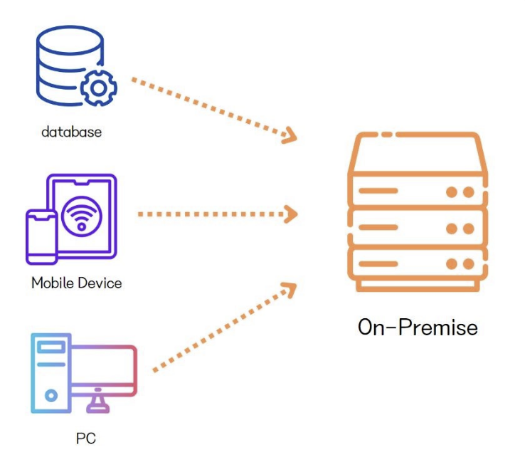
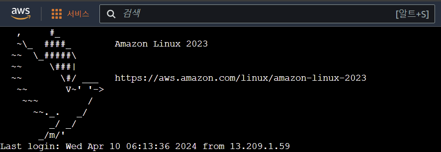
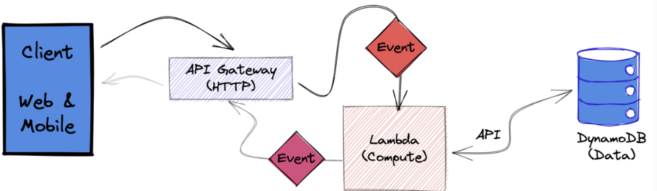
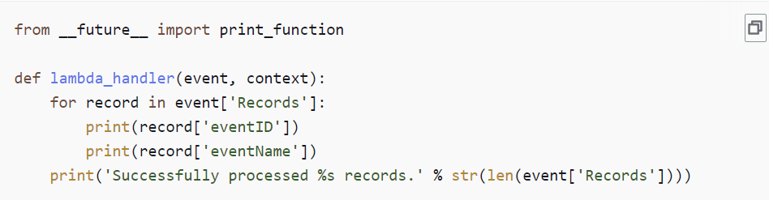
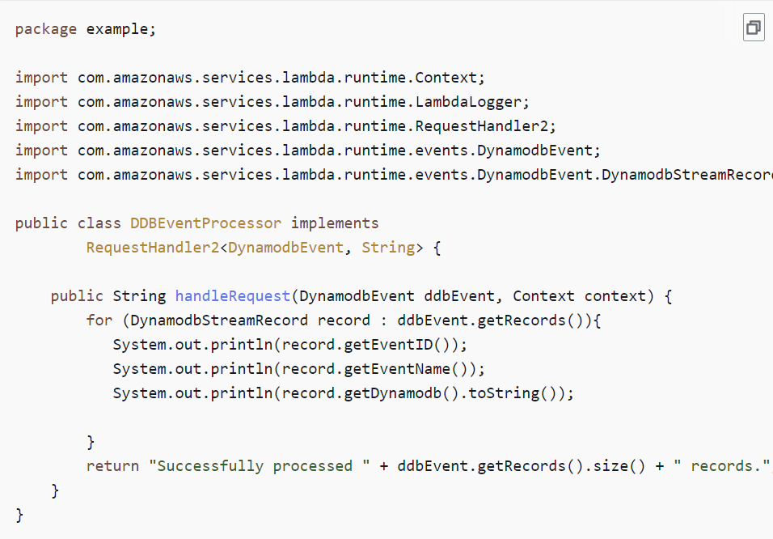

서버의 구축과 관리는 백엔드 개발자들에게 빼놓을 수 없는 부분이다. 나 또한 로컬 환경에서만 구현을 했었기에, 지난 프로젝트(아직 진행중....)의 API 구현과 배포를 위해 구글과 여러 공식문서들을 꾸역꾸역 뇌에 주입했었다. 
근데 여러 정보들을 헤엄치면서 '서버리스'라는 표현을 종종 접할 수 있었다. 서버가 적다? 없다? 달콤한 말이 아닐수가 없었다. 고맙게도, 이번에 새로 시작하는 프로젝트에서 AWS Lamda와 AWS CDK를 채택하게 되어, 그 시작을 열어볼 수 있었다.
~~(선배 개발자인 친구 말에 따르면 이게 지금 실무에서 유망하다며, 노다지라고 하더라)~~

> ###  서버리스(Serverless)
-서버가 없다?

 서버(Server) + 리스(less)의 단어 조합만 보고는 '서버가 없다'라고 생각하기 쉽다. 허나 모든 애플리케이션의 서비스는 DB와 서버가 필요하기 때문에 서버리스는 정확히는 '서버가 없다'가 아니라 _**'서버를 관리하지 않아도 되는'**_ 클라우드 컴퓨팅의 종류라 할 수 있다. 
 
> ### 서버리스의 등장 배경 (온 프레미스 vs 클라우드(오프 프레미스)
-코딩하기도 바쁜데 서버까지 어떻게 신경 써??!

**온프레미스(On-Premise)** 란 직접 IT 인프라, 서버를 설치해 사용하는 것을 의미한다. 클라우드 컴퓨팅 방식이 일반화되기 이전에 다수의 기업들이 채택한 방법이며, 하드웨어와 소프트웨어를 모두 구축, 유지해야하며 서버 시설을 갖춰놓을 물리적인 공간도 따로 필요했다. 

보안 유지와 같은 장점도 존재했지만, 실물 하드웨어로 서버 용량을 늘려야 하는 등, 불편한 점도 많았기 때문에, 다른 업체가 제공, 관리하는 서버 컴퓨터를 임대하는 방식의 클라우드 컴퓨팅 방식이 탄생하게 되었다.

AWS의 EC2와 같은 클라우드 컴퓨팅을 사용한다면 직접 실물 하드웨어의 구비 없이, 개발자는 개발 자체에 집중할 수 있다. 하지만 빈 하드웨어만을 제공하기 때문에, 여전히 개발자는 필요한 소프트웨어들을 설치 및 관리해줘야 한다.

또한 대부분의 클라우드 컴퓨팅 시스템이 시간당 비용을 결제하는 방식을 택하기 떄문에, 서버의 사용이 없더라도 비용이 청구된다.

이런 한계점들을 해결하기 위해 서버리스가 등장하게 되었다.

> ### 서버리스 컴퓨팅
서드 파티 관리 서버 인프라에서 애플리케이션을 구축,배포할 수 있는 애플리케이션 개발 모델 (출처: AWS)

서버리스 컴퓨팅은 사용한 컴퓨팅 리소스와 저장소에 대해서만 비용을 청구하는 방식을 택한다. **서비스형 기능(FaaS / Function as a Service)** 과 **서비스형 백엔드(BaaS / Backend as a Service)**, 2가지의 방식이 있는데, 일반적으로 FaaS 방식을 서버리스라 칭한다.

- AWS Lamda python3 예시 코드(출처: AWS)

- java 예시 코드(출처: AWS)

FaaS는 함수를 서비스로 사용한다. 동작 순서는 다음과 같다.

1. 개발자는 특정 이벤트에 동작할 함수단위의 코드를 업로드
2. 서버는 이 함수들을 대기 상태로 변경
3. 특정 요청이나 이벤트가 들어올 경우 그에 맞는 함수를 실행해 처리
4. 작업이 종료되면 다시 함수는 대기 상태로 변경

이 함수들은 '실행 프로세스가 개발자의 영향을 받지 않도록 추상화되어 있기(요청과 처리의 과정을 개발자가 아닌 클라우드 서버가 실행하기) 때문에 서버리스 함수'라고 AWS 공식 문서는 설명한다. 
종합하자면, 함수들은 모두 잠들어있으며, 특정 요청 시에만 깬 후에 작업 처리 후 다시 잠에 든다. 

> #### 서버리스의 장점

- 서버를 빌린 시간이 아닌 함수의 호출 횟수 대로 비용이 청구된다. AWS Lamda의 경우 백만건의 호출 당 20센트가 청구되기에, 비용 측면에서 다른 클라우드 컴퓨팅 방식보다 경제적이다.
- 서버에 신경을 쓰지 않아도 되기 때문에 개발자들은 코드 작성에 더 집중할 수 있다.

> #### 서버리스의 단점

- Cold Start: 서버가 항시 열려있는 것이 아니기 때문에 느리다. 
- 실행 시간의 한계: 서버리스 환경에서는 함수 호출 시 사용가능한 시간과 메모리에 제한이 있다. 동영상이나 용량이 큰 사진 전송의 경우 1회의 함수 호출안에 완료되지 못할 가능성이 크며, 여러 번 함수를 호출해야하는 상황이 발생할 수 있다.

- Stateless: 서버리스 환경은 Stateless이벤트 및 기능별로 함수들이 호출되기 때문에 전,후 상황의 공유가 불가능하다. 이에 따라 디버깅의 불편함이 있으며 로컬 변수와 데이터들의 저장 및 공유가 어렵다.

위와 같은 단점 때문에 기업 서비스 같은 경우 다른 클라우드 컴퓨팅과 서버리스 혼합해서 쓰는 방식을 자주 택한다고 한다.

결론적으로 '서버를 신경 쓰지 않아도 된다"의 의미는 코드의 작성만 완료한다면 서버의 보안, 백업(ex) 인바운드, 아웃바운드, 등 기존에 필요했던 추가 작업들은 모두 클라우드 제공 기업에서 관리한다는 의미이다.

획기적이면서 편해보이지만, 달리 생각해보면 분산되있던 작업들을 모두 코드에서 다 처리한다는 의미이기 때문에, 숙련도가 필요한 부분이라는 생각이 든다.