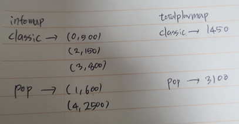
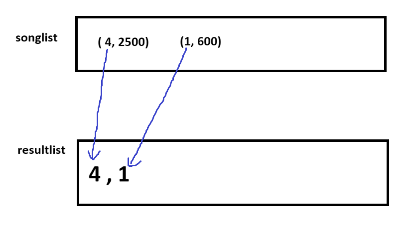
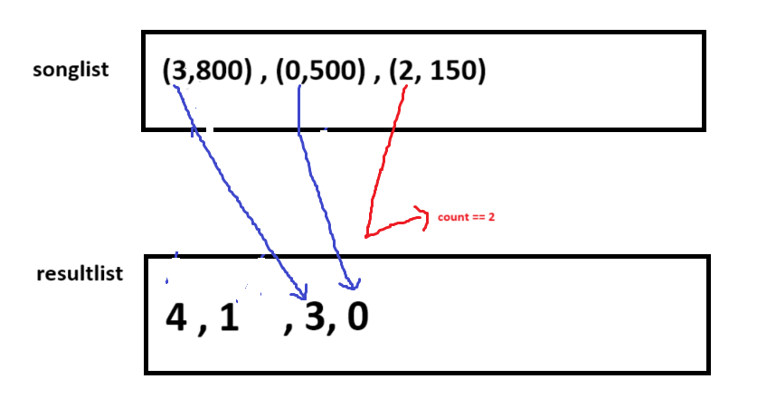

### 문제 설명

스트리밍 사이트에서 장르 별로 가장 많이 재생된 노래를 두 개씩 모아 베스트 앨범을 출시하려 합니다. 노래는 고유 번호로 구분하며, 노래를 수록하는 기준은 다음과 같습니다.

1. 속한 노래가 많이 재생된 장르를 먼저 수록합니다.
2. 장르 내에서 많이 재생된 노래를 먼저 수록합니다.
3. 장르 내에서 재생 횟수가 같은 노래 중에서는 고유 번호가 낮은 노래를 먼저 수록합니다.

노래의 장르를 나타내는 문자열 배열 genres와 노래별 재생 횟수를 나타내는 정수 배열 plays가 주어질 때, 베스트 앨범에 들어갈 노래의 고유 번호를 순서대로 return 하도록 solution 함수를 완성하세요.

제한사항
* genres[i]는 고유번호가 i인 노래의 장르입니다.
* plays[i]는 고유번호가 i인 노래가 재생된 횟수입니다.
* genres와 plays의 길이는 같으며, 이는 1 이상 10,000 이하입니다.
* 장르 종류는 100개 미만입니다.
* 장르에 속한 곡이 하나라면, 하나의 곡만 선택합니다.
* 모든 장르는 재생된 횟수가 다릅니다.


프로그래머스 hash 문제의 특징일수도 있지만, 입력 배열에 중복값들이 존재할 경우 hashset, hashmap을 이용하는 문제일 확률이 높다. 잘 기억은 안나지만 최근 네이버 코테 1번 같은 경우도 이와 비슷한 형태의 입력 배열을 받는 문제 였는데, hashmap을 이용해 풀 수 있었다.

처음에는 <String, Integer> 처럼 map 기본 형태만을 사용하여 풀었는데 생각보다 잘 풀리지 않았다. <장르, 총재생횟수> , <곡번호, 재생횟수> 등 기본 형태만을 사용하였을 경우 3개의 정보가 엮여있는 해당 문제의 연관관계를 이용하기가 쉽지 않았다. 해답의 결정적인 열쇠는 hashmap 안에 다른 hashmap을 value로 넣어주는 것이었다.

```
HashMap<String, HashMap<Integer, Integer>> infomap = new HashMap<>();
 HashMap<String, ArrayList<String>> map = new HashMap<String, ArrayList<String>>();

```
<String,Integer>와 같은 기본 형태만 사용할 경우, value 부분에 단일 값만 들어가기에 연관관계가 있는 정보의 경우 다른 map을 생성하는 등의 추가 작업이 필요해지며 연산이 복잡해진다.(내 머리는 2배로 복잡해진다.) value 부분에 추가로 자료구조를 할당할 경우, get을 통해 추가적인 조작이 한 map 안에서 가능해진다.

```
//ex)
  for(String genre : genres){
            infomap.put(genre, new HashMap<>());
        }
   for(int i = 0; i < genres.length ; i++){
            infomap.get(genres[i]).put(i, plays[i]);
            //infomap.get(genres[i]) ==> new HashMap<>() 이므로
            //put으로 값 추가 가능
        }
```

1. 기본 세팅(map 생성)

```
import java.util.*;
class Solution {
    public int[] solution(String[] genres, int[] plays) {
        //<장르, HashMap<곡 ID, 곡 재생횟수>
        HashMap<String, HashMap<Integer, Integer>> infomap = new HashMap<>();
        //<장르, 총 재생횟수>
        HashMap<String, Integer> totalplaymap = new HashMap<String, Integer>();
        
        // infomap의 초기화
        for(String genre : genres){
            infomap.put(genre, new HashMap<>());
        }
        
        // infomap 및 totalplaymap 값 대입
        //getOrDefault -> 키 값이 있다면 첫번째 인자를 반환, 없다면 default 값으로 설정해놓은 값을 반환
        for(int i = 0; i < genres.length ; i++){
            infomap.get(genres[i]).put(i, plays[i]);
            totalplaymap.put(genres[i], totalplaymap.getOrDefault(genres[i], 0) + plays[i]);
        }
```


문제의 정렬 조건은 장르별 총 재생 횟수, 곡 당 재생 횟수, 곡의 고유 번호 3가지이다. 뇌를 빼고 바로 a: <장르, 총 재생횟수> b: <곡 고유번호, 재생횟수> c: <곡 고유번호, 장르> 의 3가지 map을 처음에 만들었지만 이 경우 코드도 복잡해지고, 이 후 재생횟수로 정렬을 하더라도, b에는 장르 정보가 없기 때문에, c에서 한번 더 꺼내오는 작업이 필요해진다. (벌써 어질어질하다.)

1,2,3의 정렬 조건에서 모두 장르를 따지기 때문에 장르는 재생횟수, 고유번호를 담는 자료구조에서 모두 필요해보인다. 따라서 <장르, <곡 고유번호, 곡 재생횟수> , <장르, 총 재생횟수> 2개의 map으로 초기 자료구조를 세팅하였다. 입출력 예시를 기반으로 한 초기 2개의 map은 다음과 같다.




2. 최대 재생수인 장르 정렬
```
> // totalplaymap을 이용하여 장르를 재생 횟수 기준 내림차순으로 정렬한 sortedGenres.
  // Map 구조는 정렬이 안되므로 list형태로 keyset을 받아 sort해준다.
        List<String> sortedGenres = new ArrayList<>(totalplaymap.keySet());
        sortedGenres.sort((a, b) -> totalplaymap.get(b) - totalplaymap.get(a));
```

hashmap은 정렬이 안되기 때문에 따로 ArrayList를 만들어 정렬을 한다.
1번의 정렬조건, 총 재생횟수가 가장 많은 장르 순으로 담기 위해 keySet을 불러와 ArrayList에 내림차순으로 정렬해준다. 이 때 compare되는 기준은 totalplaymap의 value값(총 재생횟수이다.)
```
sortedGenres === [ "pop", "classic" ]
```

3. 장르별 곡들 정렬
```
// 결과 리스트, answer
        List<Integer> resultList = new ArrayList<>();

        // 각 장르별로 곡 당 재생수로 다시 정렬
        for (String genre : sortedGenres) {
            List<Map.Entry<Integer, Integer>> songList = new ArrayList<>(infomap.get(genre).entrySet());
            songList.sort((a, b) -> b.getValue() - a.getValue());

            // 상위 2곡 선택
            int count = 0;
            for (Map.Entry<Integer, Integer> song : songList) {
                if (count == 2) break;
                resultList.add(song.getKey());
                count++;
            }
        }
```
2번의 조건 "장르 내에서 많이 재생된 노래를 먼저 수록합니다."에 따라 이번에는 infomap을 통해 각 장르 별로 곡을 정렬한다. sortedGenres의 genre를 통해 infomap에서 entryset을 꺼내오기 때문에 songList에는 가장 많이 재생된 장르의 곡들부터 차례대로 삽입된다. 
a. String genre == "pop"

b. String genre == "classic"


반복문이 완료되면 resultlist를 answer에 담아주면 끝!

3. 전체코드
```
import java.util.*;

class Solution {
    public int[] solution(String[] genres, int[] plays) {
        //<장르, HashMap<곡 ID, 곡 재생횟수>
        HashMap<String, HashMap<Integer, Integer>> infomap = new HashMap<>();
        //<장르, 총 재생횟수>
        HashMap<String, Integer> totalplaymap = new HashMap<String, Integer>();
        
        // infomap의 초기화
        for(String genre : genres){
            infomap.put(genre, new HashMap<>());
        }
        
        // infomap 및 totalplaymap 값 대입
        //getOrDefault -> 키 값이 있다면 첫번째 인자를 반환, 없다면 default 값으로 설정해놓은 값을 반환
        for(int i = 0; i < genres.length ; i++){
            infomap.get(genres[i]).put(i, plays[i]);
            totalplaymap.put(genres[i], totalplaymap.getOrDefault(genres[i], 0) + plays[i]);
        }

        // totalplaymap을 이용하여 장르를 재생 횟수 기준 내림차순으로 정렬한 sortedGenres.
        // Map 구조는 정렬이 안되므로 list형태로 keyset을 받아 sort해준다.
        List<String> sortedGenres = new ArrayList<>(totalplaymap.keySet());
        sortedGenres.sort((a, b) -> totalplaymap.get(b) - totalplaymap.get(a));

        // 결과 리스트, answer
        List<Integer> resultList = new ArrayList<>();

        // 각 장르별로 곡 당 재생수로 다시 정렬
        for (String genre : sortedGenres) {
            List<Map.Entry<Integer, Integer>> songList = new ArrayList<>(infomap.get(genre).entrySet());
            songList.sort((a, b) -> b.getValue() - a.getValue());

            // 상위 2곡 선택
            int count = 0;
            for (Map.Entry<Integer, Integer> song : songList) {
                if (count == 2) break;
                resultList.add(song.getKey());
                count++;
            }
        }

        // 결과를 배열로 변환
        int[] answer = new int[resultList.size()];
        for (int i = 0; i < resultList.size(); i++) {
            answer[i] = resultList.get(i);
        }

        return answer;
    }
}
```
map 안에 map 넣을 줄을 몰라서 많이 해맸던 문제...이번엔 풀이를 참고했지만 다음에는 혼자 힘으로 풀어보자.

> reminder
HashMap 안에 자료구조를 value로 삽입 가능. 이 경우 get으로 가져와서 자료구조에 맞는 연산, 메소드 사용 가능하다.
    (a.get(키).put/push/add .....)


https://school.programmers.co.kr/learn/courses/30/lessons/42579
프로그래머스 알고리즘 고득 kit 해시 - 베스트 앨범