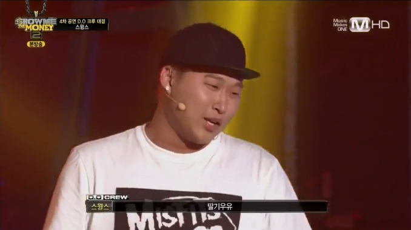
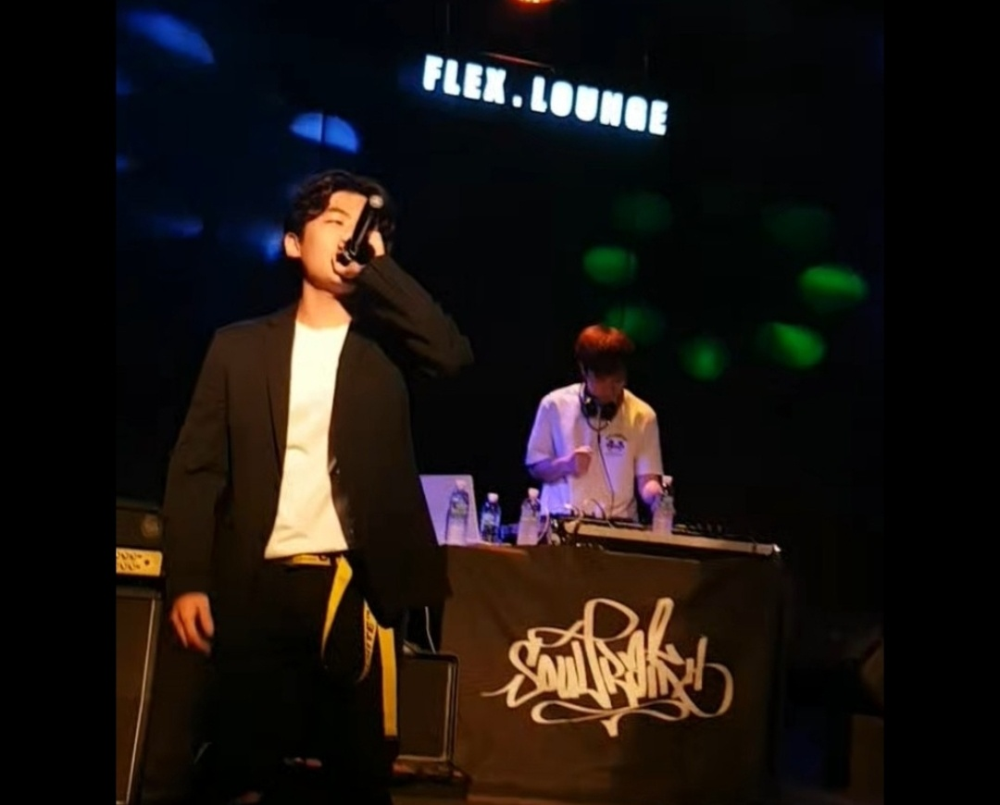
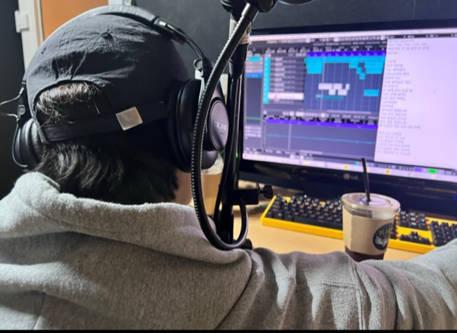
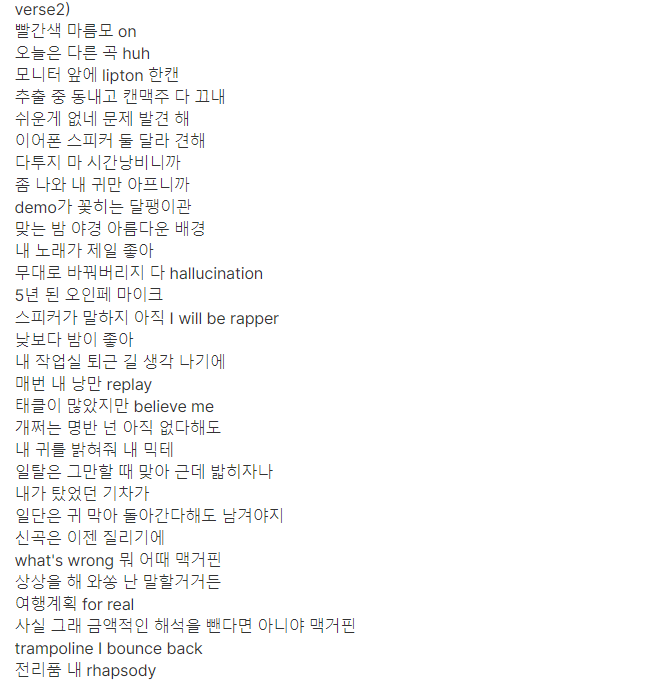

### 서론
'밑바닥부터 올라왔다'. '다 떄려치고 음악만 해서 여기까지 왔다.' '밥 먹고 음악만 했다.' 성공한 음악가들, 아마 특히 래퍼들이 많이 하는 말인 것 같다. 솔직히 멋있다. 부럽기도 하고. 나는 못하겠던 그들의 용기가 멋있다는 것이 맞는 말일 것 같다. 취미반이 무섭다는 말이 있듯이, 나도 한 때는 정말 말그대로 '밑바닥'(~~반지하니까 밑바닥 맞지~~)에서 음악하던 때가 있었다. 음악과는 조금 멀어진 지금, 영김건의 음악 인생 회고에 대해 한번 써보려고 한다. 또 어떻게 건강하게 음악할지에 대해서도 적어보려고 한다. ~~(힙찔이 모먼트 대방출인데 항마력이 필요하실 수도 있습니다.)~~
> ![]_동기가 그려준 저인데 닮았나요_

### #시작
> ![] _이 때는 딸기우유 플러팅이었는데_

중학교 2,3학년 때였나, 그 때 즈음 쇼미더머니 2가 방영중이였는데 시즌 3,4,5 만큼 선풍적이진 않았지만 나에게는 충격적이었다. 특히 위의 사진에 있던 스윙스가 무반주로 했던 Raw라는 무대가 있는데 요새도 돌려볼 정도로 너무 멋있었다. 뻔한 사랑 얘기가 아닌 진짜 자기 얘기를 노래로 한다는 점이 가장 맘을 홀렸다. 
슈프림팀, 다이나믹 듀오 정도의 노래들은 듣고 있었지만 쇼미2를 계기로 더욱 찾아서 듣게 되었던 것 같다. 드렁큰 타이거부터 버벌진트, 리쌍, 에픽하이, 마이노스, 일리닛 등등.. 십수년전 노래들까지 찾아서 들었고 더욱 빠져들었다. 직접 가사를 끄적여보긴 했으나 지금만큼 진지하게 하지는 않았고 그저 팬이었던 것 같다.

### 대학교 버킷리스트
> ![] _알와유가 아무리 날구_
https://youtu.be/n24RUxJwFyg?si=SMpbMw0wzmWtVQxx

미리 정해놓은 진로는 없었지만 대학가서 꼭 하고 싶었던 3가지는 있었다. 탈색, 문신, 귀걸이. 여기에 후에 하나 더 추가된 게 힙합 동아리였다. 힙합음악을 사랑했지만 직접 녹음하고 노래를 만들어보자는 생각은 해본적이 없었다. 근데 고등학교 2학년으로 올라갈 무렵 위의 고려대 연세대 디스전 영상을 접했다.(지금 들어도 옛것의 쌈@뽕함이 있다.) 
쇼미더머니2 이후 또 한번의 충격이었다. '이게 대학생?' '엄마한테 안 혼나나? 새벽인데?' '녹음은 어떻게 한거지?' '이게 수능을 통과한 자의 특권?!' 등등. 진로는 이미 뒷전이었고 그때부터 더욱 대학에 꼭 가야겠다는 확신이 들었다.

### Soultrain(feat.영김건)
> ![]_무려 5년전 대체 왜 정장을 입고 갔을까_

대학교 2학년 때, 본격적으로 힙합 동아리(소울트레인, 이하 솔트)에 입부했다. 고등학생 시절의 로망이 동아리 방에 전부 펼쳐져 있었다. 가래가 끓는 매개한 지하 공기, 먼지 쌓인 스피커와 각종 녹음 장비들이 나를 반겨주었고 가슴이 벅차올랐다. 지금 들으면
손 발 다리미질이 필요해지지만, 그 당시에는 좋아서 밤새 박혀있고 그랬었다. 가장 행복했던 기억은 정기 공연이었는데, 실제로 대여한 공연장에서 내가 쓰고 만든 노래들을 부르는 경험은 지금도 하나 하나 잊지 못한다. 마약을 하면 극한의 행복감을 느낀다는데, 무대 위에서 항상 그런 느낌을 받았다.(물론 해본적은 없다)
> ![] _3년전 머리 길때. 자르지 말걸_

군대를 갔다오고, 21년 7월에 전역을 했는데 개강 까지 8개월의 시간이 비었다. 바로 복학을 할 수도 있었지만, 엇학기였고 전역 1달차에 바로 학생이 되고 싶지 않았다. 너무 감사하게, 부모님도 흔쾌히 허락해주셨고, 건대 근처의 지하 작업실을 구해 본격적인 음악 생활을 시작했다.  
> ![]아버지 白 '공부를 그렇게 해봐라'

이때는 진짜 미친 듯이 노래만 만들었었다. 미래에 대한 걱정이 없어보이는 아들로서의 눈치보임도 있고, 월세가 은근 부담되었던 것도 있지만, 마음대로 하고 싶은 것을 할 수 있는 기회가 언제 오겠냐 싶었다. 아침 운동 후 부리나케 달려가서 새벽 1,2시 쯤에 항상 집에 왔었던 것 같다. 집에 올때면 항상 그날 만들었던 데모 곡들을 들으면서 밤길을 걸었고, 새벽 공기는 상쾌했다. 내가 수능 이후로 무언가에 이렇게 몰두할 수 있구나라는 것을 다시 한번 깨달았다.
> ![] _나 진짜 스토리 안올리는데 이때 진짜 슬펐나보다_

복학을 하며 작업실과 안녕을 고했다. 예정된 수순이었지만 괜히 8개월간 부볐던 곳을 떠나려니 뭔가 가슴이 먹먹했다. 계속 작업실에 있고 싶은 마음도 있었지만, 어느덧 24살이라는 불안감과 다른 동기들도 대부분 복학을 하던 터라, 슬펐지만 억울하진 않았다.  복학 이후에는 국방색과 스피커에 절여진 뇌를 빨고, 다시 개발자로 돌아오기 위해 노력했다. 와중에 학업을 게을리 하진 않았지만 동아리, 음악 활동도 게을리 하지 않았었다. 물론 남들 코테 풀 때 가사 쓰고, 남들 코딩 할때 녹음하기는 했던 것 같다. 보통의 개발자 지망생들이라면 코딩만 했을 시간을 음악과 쪼개 쓴 정도..?

### 후회??
> 
![]~~_멋지다 생각했는데 지금 보니 좀 심령사진 같네요_~~

'딱 마지막으로 믹스테잎 하나만 내고 그만하자' 4학년 1학기 여름방학. 어떻게 보면 취준을 시작해야할 시기였는데, 또 이놈의 홍대병이 도졌다. 정말 사회에 던져질 생각을 하니, 이대로 내 음악 생활을 끝내는 것이 아쉬웠다. 그렇게 어떻게 보면 귀한 4학년 여름방학을 나는 '맥거핀' 믹스테잎을 내는데 통째로 써버렸다.
(사실 이외에 아무것도 안한 건 아니다. 연초에는 ICT 인턴십 준비를 했었고, 진행했던 프로젝트 정리 및 졸업 준비를 했다.)
건대의 작업실에 있을 때 처럼, 장소만 집으로 바뀌었을 뿐 가사 쓰고, 녹음하는데 하루를 다 썼다. 지금 생각해보면, 진짜 마지막이라 생각해서 그랬던건지, 밥도 거르면서 조금 병적으로 붙들었던 것 같다. 이거를 끝내야지만 다른 일을 새 마음가짐으로 할 수 있을 것만 같은 기분이었다.

### verse 1
![]
어쩌면 반발심이 들어서 그랬던 것 같기도 하다. 나는 제목을 완성 후에 정하는 편이라 '맥거핀'도 처음에는 맥거핀이 제목이 아니었다. 한창 '맥거핀'을 만들던 시기에 친구와 술 한잔을 하게 되었는데, 한창 미래에 대한 얘기가 오고 가던 와중에 뭐하냐는 친구의 물음에 마지막 믹스테잎 작업 중이라고 답했다. 노래도 자주 듣고 응원을 해주던 친구였기에 거리낌 없이 답했지만 알코올 섞인 친구의 대답은 그날따라 날카로웠다. '이제는 정신차릴때지 않냐.' '언제까지 그거 붙들고 있을거냐.' '진작에 취준 시작한 애들이 태반인데 너는 지금 늦었다.' 걱정과 우려가 재료였던 친구의 말이었겠지만, 그 맛은 떫고 썼다. 
오랜만에 만난 친구들이었지만 귀갓길은 편치 않았다. 집에 와서도 계속 곱씹게 되었고, 지난 나의 음악 생활이 미워졌다. 자식 같았던 내 노래들이 전부 '맥거핀' 처럼 보였고, 정리 안되는 나의 마음을 한자 한자 눌러서 가사로 녹음을 했다.

> ![] _pic by ㅇㅅ, last dance 와주신 모든 분들 너무 감사했습니당_

그때 당시에는 학업과 졸업 준비에 묻혔지만, 몇 달전 까지도 이러한 회의와 후회는 머리 속에서 종종 튀어나왔다. 왜 그렇게 목메는지 그저 좋아서라고 밖에 설명하지 못하는 일 때문에, 다 포기하고 업으로 삼을 용기도 없는 일 때문에 내 앞날에 얼룩을 만든 것 같아 한동안 음악용 컴퓨터는 켜지도 않았었다.(바빴던 탓도 있지만) 취준을 하며 쓰는 자소서의 구멍들을 볼때면, 작업실 탓을 하게 되었고, 막막해지는 코딩테스트 앞에서는 동아리 탓을 하게 되었다.

### verse2
![]

내가 듣고 싶어서 만들 정도로, 내 노래만 주구장창 들었는데, 회의감에 빠졌던 한동안은 내 노래를 듣기를 피했었다. 헌데 막상 다른 노래들을 들으려니 재미가 없었고, 귀만 아팠다. 노래를 들으며 힘을 얻고 할일을 하러 가야했는데 힘이 도통 나지 않는 기분이었다. 

시간이 약이라는 말처럼, 정신없이 살다보니 회의감과 쓰림은 점점 잊혀져갔고 다시 플레이리스트에는 내 노래들이 채워졌다. 어느날 문득 당시에 쓸 때는 막 갈겼던 가사 같은데 '금액적인 해석을 뺀다면 아니야 맥거핀' 구절이 꽂혔다. 

### 인생은 한번
> ![]_진짜 못했는데 되게 잘하는 것처럼 찍혔다_

살아가는 데 있어 돈은 필수적이라 생각한다. 행복을 살 수 있다는 말에도 어느 정도 동의한다. 그럼 돈이 안되는 일은 불필요하다? 이 말에는 절대 동의 못하겠다. 밤새 녹음하고 만든 노래들로 뛰었던 무대들은 그 온도까지 기억날 정도로 아직 생생하며 돈 주고도 못살 경험이라고 생각한다. 막말로 무대에서 자기 생각과 표현들을 뱉어본 사람이 얼마나 되겠는가. 울어도 보고, 화도 내봤고, 웃어도 봤던 내 빛났던 순간이 담겨져있는 소리들을 돈이 안되고, 미래에 도움이 안된다는 이유들로 음소거하기에는 너무나 아깝다. 또 어떻게 알아. 미래에 역주행할지?

사람의 뇌에는 주름이 자글자글하다. 그렇게 주름 사이 사이가 많은데 좋아하고 사랑하는 것이 하나밖에 없는 것은 말이 안된다. 정도의 차이가 있고 우선순위가 있겠지만 다양한 좋아함이 합쳐져서 하나의 '나'가 된다 생각한다. 1등의 좋아함이 자신의 돈벌이나 직업으로 이어지는 것이 최고겠지만, 정말 드문 케이스일 것이다. 음악이 직업이 된다면 정말 좋겠지만, 너무 나와는 먼 얘기인 것 같고, 사실 그럴만한 용기가 없기도 하다. 그저 내 생각을 이쁘게 얹고 기록하며, 그 당시의 기억을 소리로 보관하는 것이 좋다.

좋아함은 솔직해서 억지로 거스르면 탈이 난다. 반대로 '맥거핀' 작업 때 내가 그랬듯, 정도를 넘는 과한 좋아함은 집착이 되며 오히려 자신을 헤친다. 억지로 피하고 누르는 것보다 인정하고 즐기는 것이 '건강한 좋아함'이라고 생각한다.

> ![] 낮에는 조용한 명문대생, 밤에는 무대를 장악하는 뮤지션 

분기마다 보는 잔나비의 라이브 영상에 달린 댓글인데 정말 멋있는 말인 것 같다. '낮에는 조용한 개발자가 무대에서는 래퍼?!' 라는 말이 자기소개인 사람으로 성장하고 싶다.

모두가 정말 치열하게 사는 세상인 것 같다. 성공보다는 실패가 익숙해진 지금, 누구든 비난의 화살을 자신의 '좋아함'으로 돌리지 않았으면 좋겠다. 빛나는 순간들을 안겨준 자신의 모든 '좋아함'을 인정하고 모두 멋있는 잔나비가 되길 바란다.

*****
_~~~~긴 글 읽어주신 모든 분들 감사합니다.
또 이런 글을 쓰게 해준 개블쓰 감사합니다!~~~~_

혹시 영김건의 노래가 궁금하다면?
https://soundcloud.com/ssvwi3anxtoi
