## 서론
![]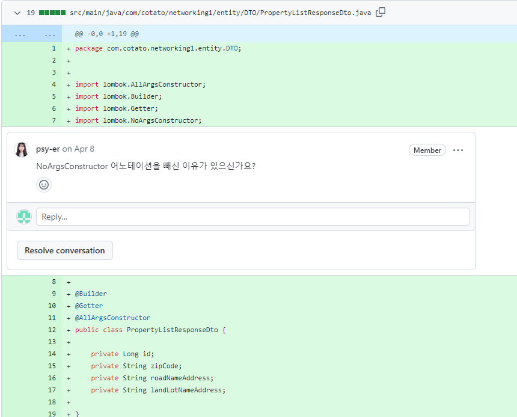
![]
저거 빼도 돌아가서요...?

![]

아 원래 어노테이션은 빨간 줄 안뜰때까지 @ 다는거라구요...!
![]
![]
DTO의 무분별한 어노테이션 사용을 줄이고 언제 써야하는지에 대해 알아보자


## Annotation이란?
사전적 의미로는 주석이란 뜻이지만, Java에서 Annotation(@)는 코드에서 특별한 의미, 기능을 수행하도록 소스 코드에 추가해서 사용할 수 있는 메타 데이터의 일종이다. 여기서 메타 데이터란 애플리케이션이 처리해야 할 데이터가 아니라 컴파일 및 런타임 과정에서 코드를 어떻게 처리해야 할지 알려주기 위한 추가 정보이다.


## DTO란?
Data Transfer Object의 줄임말로 계층 간 데이터 교환을 위한 객체이다. 실제 Entity를 꺼내와서 로직 실행 시 DB 손상의 위험이 있으므로, DB의 실제 데이터를 DTO에 담아서 로직에서 사용한다. 필요한 데이터들만을 명시하기 때문에 가독성에도 기여를 할 수 있다.

이제 그럼 다시 서론의 PropertyListResponseDTO의 annotation들에 대해 알아보자. @RestController, @Service 등 다른 어노테이션이 많지만 DTO에 사용할 만한 annotation들 위주로 알아보자.

### 1. @Getter, @Setter
```
import lombok.Getter;
import lombok.Setter


public class UserDTO {
	
    @Getter @Setter
    private String name;
    
    @Getter
    private String email;
}
```
DTO 내 필드에 선언할 수 있으며, 선언한 필드에 자동으로 getter와 setter 메소드를 생성한다. 

### 2. @Data
```
import lombok.Data;

@Data
public class UserDTO {
    private String name;
    private String email;
}
```

DTO 전체에 선언 시 getter, setter, toString, equals, hashCode 메소드 등을 자동으로 생성한다. @Data를 선언할 시 @Getter, @Setter는 따로 선언하지 않아도 되는 것.

### 3. @Builder
```
import lombok.Builder;

@Builder
public class UserDTO {
    private String name;
    private String email;
}
```
DTO의 빌더 패턴을 자동 생성한다. 객체 생성 시 가독성을 높여주고, 필드들을 선택적으로 쉽게 다룰 수 있게 된다.

### 4. @NoArgsConstructor 및 @AllArgsConstructor

```
import lombok.NoArgsConstructor;
import lombok.AllArgsConstructor;

@NoArgsConstructor
@AllArgsConstructor
public class UserDTO {
    private String name;
    private String email;
}
```
기본 생성자 및 모든 필드를 인자로 받는 생성자를 자동으로 생성한다.
기본 생성자 ==> new UserDTO()
모든 필드 인자 생성자 ==>new UserDTO(String name, String email)

### 5. @Valid + 유효성 검사 어노테이션

```
import javax.validation.constraints.NotNull;
import javax.validation.constraints.Size;
import javax.validation.constraints.Email;

public class UserDTO {
    @NotNull
    @Size(min = 1, max = 100)
    private String name;
    
    @NotNull
    @Email
    private String email;
}
```

DTO 필드의 유효성 검사를 적용한다. 대표적으로 @NotNull, @Size, @Email 등이 있으며 controller 단에서 @Valid 어노테이션과 함께 사용된다.
import javax.validation.Valid;

```
@PostMapping("/users")
public ResponseEntity<?> createUser(@Valid @RequestBody UserDTO userDTO) {
    //DTO의 @NotNull, @Size, @Email 유효성 검사 후 로직 실행
    return ResponseEntity.ok(userDTO);
}
```

이제 서론의 DTO로 돌아가보자. 코드를 보며 **필요한 어노테이션**과 _**불필요한 어노테이션**_을 구분해보자.
![]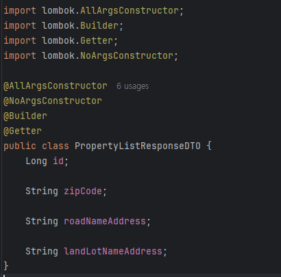

id, zip_code, road_name_address, land_lot_name_address 로 구성된 property 테이블의 모든 값을 가져올 때 사용하는 DTO이다. 
![]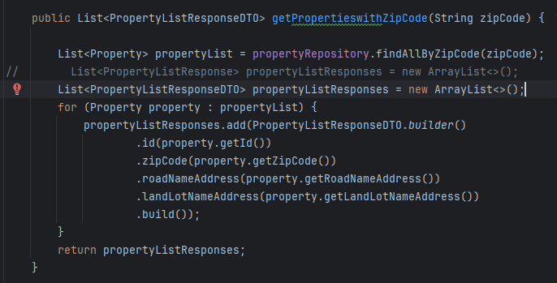

List 형태로 모든 데이터를 받아오고 이를 통해 DTO를 생성 후 클라이언트 측으로 보내준다. 일단 코드를 봤을 때 **@Builder 어노테이션을 달아놓은 이유는 명확해 보인다.** 작은 REST API라 사용처가 이 부분밖에 없고 DTO 안의 값을 꺼내오는 부분이 없기 때문에 사실 _**@Getter는 없어도 로직 수행에 문제가 없다.**_ 다음은 생성자 관련 어노테이션을 살펴보자.
![]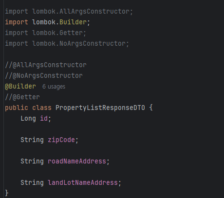

기존의 @AllArgsConstructor, @NoArgsConstructor를 모두 빼더라도 코드 상으로 문제가 없다. 하지만

![]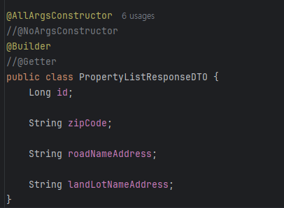
@NoArgsConstructor만 없는 이 경우는 빨간 줄이 없는데
![]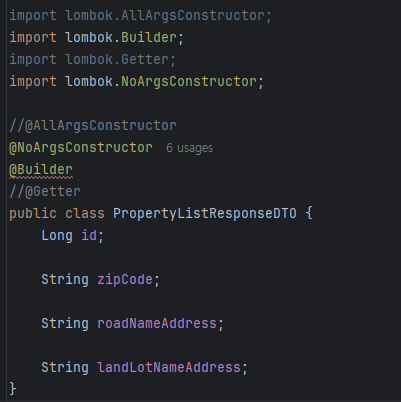
요 경우에서는 빨간 줄이 생긴다. 
![]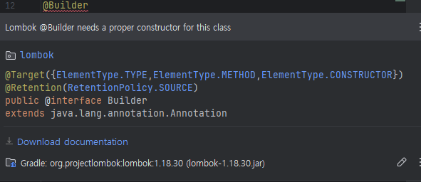

@Builder 어노테이션이 올바른 생성자가 필요하다는 에러인데 여기서 궁금증이 생긴다. @NoArgsConstructor가 기본 생성자를 만들어주는데 왜 @NoArgsConstructor는 안되지?? Java는 class 안에 생성자 구현을 생략할 경우 기본 생성자를 생성해주는 걸로 아는데 @Builder만 썼을 때는 괜찮고 왜 인자없는 기본 생성자를 만들어주는 @NoArgsConstructor만 있을 경우에는 안되는 거지? 구독한 기념으로 ChatGPT 4o이 얼마나 똑똑한지 확인차 한번 물어보자.
![]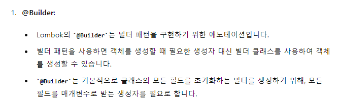

![]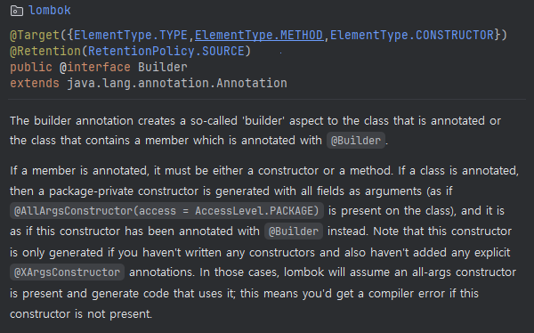

Builder의 document인데 정확히 이유가 써져있다. 문서에 의하면 @Builder는 선언된 class에 모든 필드를 인자로 가지는 생성자(@AllArgsConstructor와 같이)를 만들어준다고 한다. 하지만 이는 @XArgsConstructor의 다른 생성자를 만들어주는 어노테이션이 없는 경우에만 자동으로 만들어준다고 한다. @NoArgsConstructor를 붙여놓는 경우, @Builder는 따로 생성자를 만들지 않는데, 이때 텅 빈 기본 생성자만 있으니 모든 필드를 초기화하는 빌더를 생성하지 못하기에 에러가 발생하는 것이다. @AllArgsConstructor를 붙여놓는 경우, @Builder는 생성자를 만들지 않지만, 모든 필드를 인자로 가지는 생성자가 존재하기에 에러가 발생하지 않는 것이다. 당연한 얘기이지만 @NoArgsConstructor, @AllArgsConstructor가 모두 있을 경우에는 기본 생성자, 모든 필드 생성자 2개가 모두 생성되기 때문에 빌더 생성에 문제가 없는 것이다.

'그러면 이 경우에는 @Builder 만 붙이면 돌아가겠구나! 괜히 여러 개 붙였네!'
![]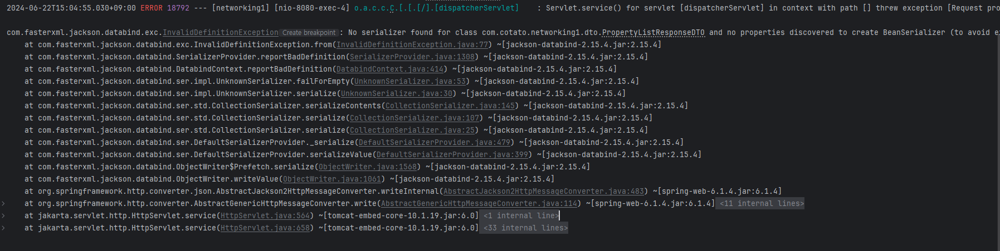
![]


에러 메세지를 확인해보자.
> **No serializer found for class com.cotato.networking1.dto.PropertyListResponseDTO and no properties discovered to create BeanSerializer (to avoid exception, disable SerializationFeature.FAIL_ON_EMPTY_BEANS) (through reference chain: java.util.ArrayList[0])**

No serializer, 즉 DTO를 직렬화할 수 없어서 발생하는 에러라 해석할 수 있다. 코드 상에서 빨간 줄만 안 뜨게 하는게 능사가 아니라는 소리이다.

### 직렬화, 역직렬화
앞서 설명했듯이 DTO는 REST API 작성 시에 Entity를 직접 사용하는 대신에 컨트롤러에서 데이터를 주고받는 용도로 사용한다. DTO를 사용함으로 Entity의 변질을 막을 수 있고, 로직에 사용되는 필드만 주고받을 수 있기에 DTO의 사용이 권장된다.

Spring Boot는 컨트롤러에서 DTO를 주고받을 때 JSON 직렬화와 역직렬화가 일어난다.

> 직렬화(serialization): Java Object가 JSON으로 변환되는 것, ResponseBody를 사용할 때 발생(Server -> Client)
역직렬화(deserialization): JSON이 Java Object로 변환되는 것, RequestBody를 사용할 때 일어난다.(Client -> Server)

### Jackson
![]
에러 메세지에서 jackson 관련 에러가 10줄 정도 우루룩 나오는데, Spring Boot에서 DTO를 직렬화, 역직렬화 할 때 동작하는 것이 Jackson 라이브러리이다. Jackson 자체를 뜯어보다가 초점이 흐려질 것 같으니 Jackson 라이브러리의 @JsonView 어노테이션 코드를 대신 살펴보자.( + 고마운 천재 개발자님들.. https://codingwell.tistory.com/182)
```
@RestController
public class UserController {

	@GetMapping("/user")
	@JsonView(User.WithoutPasswordView.class)
	public User getUser() {
		return new User("eric", "7!jd#h23");
	}
}

public class User {

	public interface WithoutPasswordView {};
	public interface WithPasswordView extends WithoutPasswordView {};

	private String username;
	private String password;

	public User() {
	}

	public User(String username, String password) {
		this.username = username;
		this.password = password;
	}

	@JsonView(WithoutPasswordView.class)
	public String getUsername() {
		return this.username;
	}

	@JsonView(WithPasswordView.class)
	public String getPassword() {
		return this.password;
	}
}
//출처 Spring Document
```

위의 코드는 Spring 공식 문서의 Jackson JSON 라이브러리를 사용하는 예시코드이다. @JsonView 어노테이션을 사용하며 getter 메소드를 정의해놓는 것을 볼 수 있다. 이처럼 Jackson 내부의 ObjectMapper가 역/직렬화를 수행할 때 getter 혹은 setter를 사용한다.


### ObjectMapper의 직렬화 과정
![]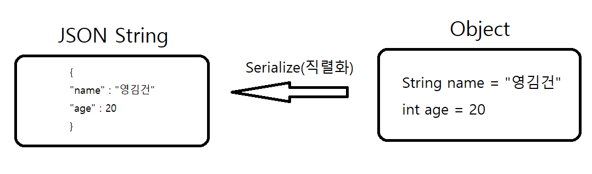

서버에서 클라이언트로 정보를 보내줄때 전달받은 DTO, 객체들을 JSON 형태의 문자열로 변환해주어야 한다. 이 때 ObjectMapper가 JSON 문자열을 만들기 위해서는 각 필드 값들을 알아야 하는데, 이때 기본 설정으로 getter를 통해서 Object의 필드에 접근을 시도한다. Object를 JSON 형태로 바꾸는 것이기 때문에 따로 생성자 없이 getter 만으로 직렬화가 가능하다.

### ObjectMapper의 역직렬화 과정
![]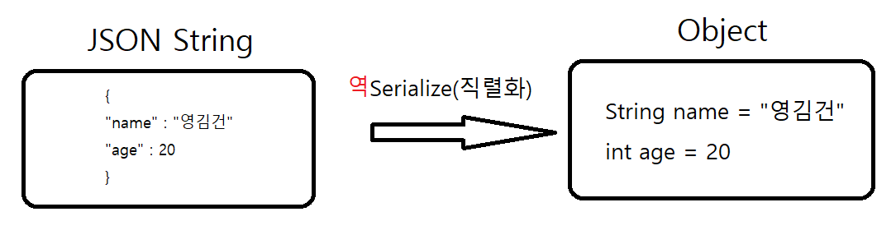

하지만 반대의 경우 생성자가 필요하다. JSON 문자열을 받아와 Object로 변환해줘야 하는데 생성자가 없다면 JSON의 데이터를 받을 객체 틀이 없기 때문이다. 따라서 직렬화 과정의 필요 요소에서 추가로 기본 생성자가 필요하다.

> * Spring Boot의 경우 원래는 역직렬화 시 기본 생성자가 필요하지만 jackson-datatype-jdk8 모듈 내부의 jackson-module-parameter-names 모듈이 기본 생성자 없이도 다른 생성자로 대체하여 역직렬화를 수행할 수 있게 한다.

정리하자면 직렬화, 역직렬화에서 원칙적으로 필요한 것은 getter, 기본 생성자이다. 따라서 @Getter를 코드 상에서 사용하지 않는다고 뺄 수가 없다는 뜻이다. 기본 생성자도 필요하지만, @NoArgsConstructor 없이도 에러가 없었던 이유는 다른 생성자로 대체하여 직렬화, 역직렬화를 수행했기 때문이다.(물론 작성한 코드에서 사용된 DTO는 직렬화 과정만 필요했지만)

### 결론 -> DTO에는 4개 다 쓰자 그냥, 웬만하면
![]

각각의 어노테이션이 필요한 이유들을  정리하면 다음과 같다.
@Builder: 빌더 형태로 객체를 생성하기 위해서
@AllArgsConstructor: 모든 필드를 받는 생성자를 만들기 위해서 + Builder
@NoArgsConstructor: 원칙적으로 역직렬화에 필요하기 때문에 (없어도 되지만 원칙이자나)
@Getter: 직렬화, 역직렬화에 필요하기 때문에

해당 코드는 작은 REST API 서버이기 때문에 PropertyListResponseDTO에서 @NoArgsConstructor가 없어도 잘 돌아갔지만, 실제 프로젝트이거나 규모가 더 커 사용처가 많았을 경우 @NoArgsConstructor가 필요했을 수도 있는 것이다. 코드의 간결화, 가독성을 위해서 사용하지 않는 코드나 어노테이션은 빼는 것이 좋겠지만, 생각보다 다 군데군데에서 필요한걸 보니, 일단 위의 4개는 붙여놓고 시작을 하는 것이 정신건강에 좋아보인다.

결론적으로 바뀐 것은 없는데, 알고 쓰는거랑 모르고 쓰는거랑은 다르니까. 이제 무지성 골뱅이 슈터가 아니라고


이렇게 길어질 줄 몰랐는데 생각보다 딥한 내용이라 이곳저곳에서 찾아보게 됐다. 원래는 Record 까지 작성할 예정이었지만 그건 다음 기회에...

출처
____
https://mommoo.tistory.com/83
https://woo-chang.tistory.com/73
https://projectlombok.org/features/Builder
https://woo-chang.tistory.com/73
https://velog.io/@rara_kim/Spring-%EC%96%B4%EB%85%B8%ED%85%8C%EC%9D%B4%EC%85%98Annotation
https://codingwell.tistory.com/182
